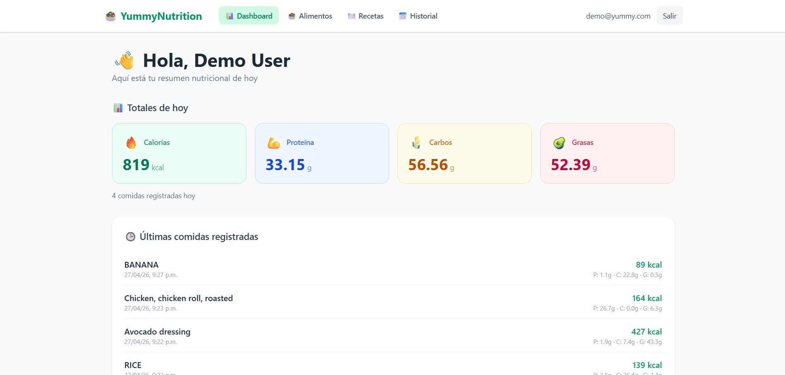
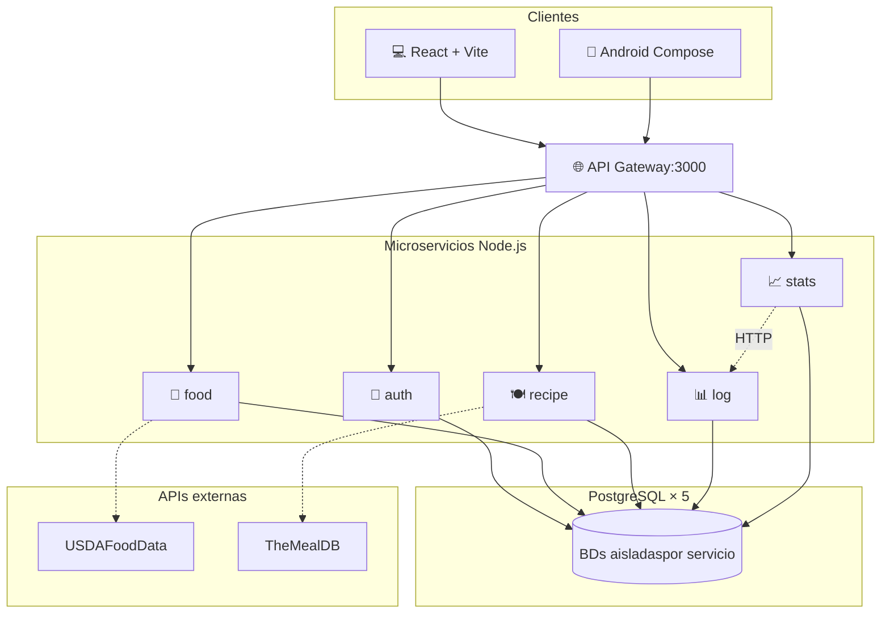

<div align="center">

# 🥗 YummyNutrition

**Sistema distribuido de seguimiento nutricional con arquitectura de microservicios**

[](https://www.docker.com/)
[](https://nodejs.org/)
[](https://www.postgresql.org/)
[](https://react.dev/)
[](https://kotlinlang.org/)
[](LICENSE)



</div>

---

## 📖 Acerca del proyecto

**YummyNutrition** es una aplicación distribuida que permite a cualquier persona registrar las comidas que consume durante el día, consultar la información nutricional de los alimentos y descubrir recetas saludables del mundo. El sistema fue desarrollado como **Proyecto Integrador de Aplicaciones Empresariales** del Instituto Tecnológico de León y demuestra una arquitectura de microservicios moderna con persistencia distribuida, dos clientes (web y móvil nativo), y orquestación completa con Docker.

El usuario puede interactuar con el sistema desde un navegador web (React + Vite) o desde una aplicación Android nativa (Kotlin + Jetpack Compose). Ambos clientes se conectan al mismo backend a través de un API Gateway centralizado, lo que garantiza coherencia de datos sin importar el dispositivo desde el que se acceda.

## ✨ Características principales

- 🔐 **Autenticación con JWT** — registro y login seguros con contraseñas hasheadas (bcrypt)
- 🥗 **Búsqueda de alimentos** con caché transparente sobre la API de USDA FoodData Central
- 🍽️ **Recetas internacionales** integradas con TheMealDB
- 📊 **Estadísticas diarias** calculadas dinámicamente con totales de calorías y macronutrientes
- 📅 **Historial completo** de comidas registradas, agrupado por día
- 📱 **Cliente Android nativo** con la misma funcionalidad que la web
- 🌎 **Zonas horarias correctas** — todos los timestamps en `America/Mexico_City` independientemente del dispositivo
- 🐳 **100% dockerizado** — un solo `docker compose up` levanta los 12 contenedores

## 🏗️ Arquitectura



Cada microservicio respeta su **bounded context**, posee su propia base de datos PostgreSQL, y se comunica con los demás únicamente por HTTP, lo que permite evolucionar cada servicio de forma independiente.

## 🛠️ Stack tecnológico

| Capa | Tecnologías |
|------|-------------|
| **Backend** | Node.js 20, Express, JWT, bcryptjs |
| **Bases de datos** | PostgreSQL 16 (5 instancias aisladas) |
| **Gateway** | Express + http-proxy-middleware |
| **Frontend Web** | React 18, Vite, TailwindCSS, Axios |
| **App móvil** | Kotlin, Jetpack Compose, Retrofit, OkHttp |
| **Orquestación** | Docker Compose |
| **Tests** | Jest + Supertest (39 unit), Cypress (6 E2E) |

## 🚀 Inicio rápido

**Requisitos:** Docker Desktop, Node.js 20+, Git.

```bash
# 1. Clonar el repositorio
git clone https://github.com/MichCelis/Yummy_Nutrition.git
cd Yummy_Nutrition

# 2. Levantar el sistema completo
docker compose up -d

# 3. Cargar datos de prueba
cd seeders
npm install
npm run seed
```

Una vez levantado, el sistema está disponible en:

- **Web:** http://localhost:8080
- **API Gateway:** http://localhost:3000
- **Usuario demo:** `demo@yummy.com` / `demo1234`

Para la guía completa de despliegue (incluyendo la app Android), consulta **[`docs/09-guia-despliegue.md`](docs/09-guia-despliegue.md)**.

## 📚 Documentación

El proyecto incluye documentación técnica completa en la carpeta `docs/`:

| Documento | Contenido |
|-----------|-----------|
| [00 - Administración del proyecto](docs/00-administracion-proyecto.md) | Equipo, cronograma, control de versiones |
| [01 - Requerimientos](docs/01-requerimientos.md) | Funcionales, no funcionales, restricciones |
| [02 - Casos de uso](docs/02-casos-de-uso.md) | Actores y flujos de interacción |
| [03 - Modelo de dominio](docs/03-modelo-de-dominio.md) | Entidades y relaciones |
| [04 - Diseño de servicios](docs/04-diseno-servicios.md) | Microservicios y patrones aplicados |
| [05 - Diagramas de secuencia](docs/05-diagramas-secuencia.md) | Flujos críticos del sistema |
| [06 - Diseño de base de datos](docs/06-diseno-base-datos.md) | Esquemas de las 5 BDs |
| [07 - Diagrama de despliegue](docs/07-diagrama-despliegue.md) | Topología de contenedores |
| [08 - Wireframes](docs/08-wireframes.md) | Diseño visual de las 6 pantallas web |
| [09 - Guía de despliegue](docs/09-guia-despliegue.md) | Tutorial paso a paso para reproducir el sistema |

Documentos de soporte en la raíz: [`API_CONTRACT.md`](API_CONTRACT.md) y [`COMANDOS.md`](COMANDOS.md).

## 🧪 Pruebas

```bash
# Tests unitarios de un servicio
cd backend/auth-service && npm test

# Tests end-to-end (requiere docker compose corriendo y seeders cargados)
cd e2e && npx cypress open
```

Cobertura actual: **39 tests unitarios** distribuidos entre los 6 servicios y **6 tests E2E** sobre flujos críticos de la web.

## 👥 Autores

Desarrollado por estudiantes de Ingeniería en Sistemas Computacionales del **Instituto Tecnológico de León**.

| Nombre | Rol | GitHub |
|--------|-----|--------|
| **Frida Michelle Milagros Celis Torres** | Desarrollo full-stack | [@MichCelis](https://github.com/MichCelis) |
| **Ángel Israel Becerra Camarillo** | Desarrollo full-stack | [@AngelIsrael03](https://github.com/AngelIsrael03) |

**Profesor:** Ing. José Luis Fernando Suárez y Gómez
**Materia:** Proyecto Integrador de Aplicaciones Empresariales (COB-2406)
**Periodo:** Enero – Junio 2026

## 📄 Licencia

Distribuido bajo la **Licencia MIT**. Consulta el archivo [`LICENSE`](LICENSE) para más información.
