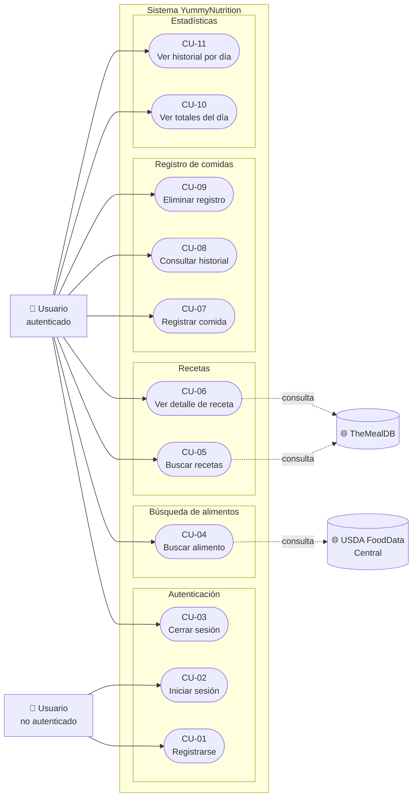

# 🎯 Casos de Uso

**Proyecto:** YummyNutrition
**Versión del documento:** 1.0
**Fecha:** Abril 2026

---

## 1. Introducción

Este documento describe los casos de uso del sistema YummyNutrition. Cada caso de uso representa una interacción entre un actor y el sistema con el propósito de alcanzar un objetivo concreto. Los casos de uso se derivan de los requerimientos funcionales descritos en el documento `01-requerimientos.md` y sirven como base para el diseño de los servicios y las interfaces de usuario.

## 2. Actores

| Actor | Tipo | Descripción |
|-------|------|-------------|
| **Usuario no autenticado** | Primario | Persona que aún no posee credenciales o que no ha iniciado sesión en el sistema. |
| **Usuario autenticado** | Primario | Persona con cuenta válida y sesión activa. Es el actor que ejecuta la mayoría de los casos de uso del sistema. |
| **USDA FoodData Central** | Secundario (sistema externo) | Provee información nutricional de alimentos cuando es solicitada por el sistema. |
| **TheMealDB** | Secundario (sistema externo) | Provee información de recetas culinarias cuando es solicitada por el sistema. |

## 3. Diagrama de casos de uso

A continuación se presenta el diagrama global de casos de uso del sistema. El diagrama agrupa los casos de uso por módulo funcional para facilitar su lectura.

> **Nota sobre el diagrama:** este diagrama está renderizado con Mermaid para mantener consistencia con el resto de la documentación técnica. En GitHub y en Visual Studio Code se renderiza automáticamente. Si se desea una versión clásica UML con stick figures, el equipo cuenta con una versión equivalente generada en draw.io disponible en `docs/diagrams/casos-de-uso-uml.png`.

## 4. Especificación detallada de casos de uso

A continuación se describe cada caso de uso siguiendo una plantilla tabular estandarizada. Esta plantilla incluye precondiciones, postcondiciones, flujo principal y flujos alternativos.

---

### CU-01 — Registrarse

| Campo | Detalle |
|-------|---------|
| **Identificador** | CU-01 |
| **Nombre** | Registrarse |
| **Actor principal** | Usuario no autenticado |
| **Descripción** | Permite a una persona crear una cuenta nueva en el sistema. |
| **Precondiciones** | El correo electrónico no debe estar registrado previamente. |
| **Postcondiciones** | Se crea un usuario nuevo en `authdb` con la contraseña cifrada. El usuario queda autenticado automáticamente y se le entrega un JWT. |
| **Disparador** | El usuario hace click en "Regístrate" desde la pantalla de login. |
| **Flujo principal** | 1. El usuario abre el formulario de registro. 2. El usuario ingresa nombre, correo y contraseña. 3. El usuario envía el formulario. 4. El sistema valida que el correo no esté registrado. 5. El sistema cifra la contraseña con bcrypt. 6. El sistema almacena el usuario en la base de datos. 7. El sistema autentica al usuario automáticamente y devuelve el JWT. 8. El cliente almacena el token y navega al dashboard. |
| **Flujos alternativos** | **A1.** Si el correo ya está registrado, el sistema responde con error 400 ("Email ya existe") y el formulario muestra el mensaje al usuario. **A2.** Si la contraseña tiene menos de 6 caracteres, el cliente la rechaza antes de enviar la petición. |
| **Requerimiento asociado** | RF-01 |

---

### CU-02 — Iniciar sesión

| Campo | Detalle |
|-------|---------|
| **Identificador** | CU-02 |
| **Nombre** | Iniciar sesión |
| **Actor principal** | Usuario no autenticado |
| **Descripción** | Permite a un usuario registrado autenticarse y obtener un token JWT. |
| **Precondiciones** | El usuario debe estar previamente registrado en el sistema. |
| **Postcondiciones** | El cliente recibe y almacena un JWT vigente por 24 horas, junto con los datos públicos del usuario. |
| **Disparador** | El usuario abre la aplicación y selecciona "Iniciar sesión". |
| **Flujo principal** | 1. El usuario abre la pantalla de login. 2. El usuario ingresa correo y contraseña. 3. El usuario envía el formulario. 4. El sistema busca el usuario por correo en `authdb`. 5. El sistema compara la contraseña ingresada con el hash almacenado. 6. El sistema genera un JWT firmado y lo entrega al cliente. 7. El cliente almacena el token y navega al dashboard. |
| **Flujos alternativos** | **A1.** Si el correo no existe en la base de datos, el sistema responde con error 404 ("Usuario no existe"). **A2.** Si la contraseña no coincide con el hash almacenado, el sistema responde con error 401 ("Contraseña incorrecta"). |
| **Requerimiento asociado** | RF-02 |

---

### CU-03 — Cerrar sesión

| Campo | Detalle |
|-------|---------|
| **Identificador** | CU-03 |
| **Nombre** | Cerrar sesión |
| **Actor principal** | Usuario autenticado |
| **Descripción** | Permite al usuario terminar su sesión activa y volver al estado no autenticado. |
| **Precondiciones** | El usuario debe estar autenticado. |
| **Postcondiciones** | El token JWT se elimina del almacenamiento local del cliente. El usuario queda en estado no autenticado. |
| **Disparador** | El usuario hace click en "Salir" desde el menú principal. |
| **Flujo principal** | 1. El usuario hace click en el botón "Salir". 2. El cliente elimina el token y los datos del usuario del almacenamiento local. 3. El cliente redirige al usuario a la pantalla de login. |
| **Flujos alternativos** | Ninguno. |
| **Notas** | El cierre de sesión es una operación únicamente del lado del cliente. El backend no mantiene una lista de tokens revocados; los tokens caducan por sí solos a las 24 horas. |

---

### CU-04 — Buscar alimento

| Campo | Detalle |
|-------|---------|
| **Identificador** | CU-04 |
| **Nombre** | Buscar alimento |
| **Actor principal** | Usuario autenticado |
| **Actor secundario** | USDA FoodData Central |
| **Descripción** | Permite buscar alimentos por nombre y obtener su información nutricional para registrarlos posteriormente. |
| **Precondiciones** | El usuario debe estar autenticado. |
| **Postcondiciones** | Se entrega una lista de alimentos con sus valores nutricionales. La búsqueda queda cacheada en `fooddb` para futuras consultas. |
| **Disparador** | El usuario navega a la sección "Alimentos" e ingresa un término de búsqueda. |
| **Flujo principal** | 1. El usuario ingresa un término de búsqueda y presiona "Buscar". 2. El sistema verifica si la búsqueda existe en su caché local. 3. Si existe en caché, el sistema responde con los resultados almacenados (`source: cache`). 4. Si no existe, el sistema consulta la API de USDA FoodData Central. 5. El sistema normaliza la respuesta extrayendo nombre, calorías, proteína, carbohidratos y grasas. 6. El sistema almacena la búsqueda y los resultados en `fooddb`. 7. El sistema entrega los resultados al cliente (`source: usda`). 8. El cliente muestra la lista de resultados al usuario. |
| **Flujos alternativos** | **A1.** Si la API de USDA no responde y no existe caché, el sistema responde con error 500 controlado y el cliente muestra un mensaje al usuario. **A2.** Si el término de búsqueda está vacío, el sistema responde con error 400. |
| **Requerimiento asociado** | RF-04 |

---

### CU-05 — Buscar recetas

| Campo | Detalle |
|-------|---------|
| **Identificador** | CU-05 |
| **Nombre** | Buscar recetas |
| **Actor principal** | Usuario autenticado |
| **Actor secundario** | TheMealDB |
| **Descripción** | Permite descubrir recetas por nombre y obtener una lista con su título, categoría, área geográfica y fotografía. |
| **Precondiciones** | El usuario debe estar autenticado. |
| **Postcondiciones** | Se entrega una lista de recetas y la búsqueda queda cacheada en `recipedb`. |
| **Disparador** | El usuario navega a la sección "Recetas" e ingresa un término de búsqueda. |
| **Flujo principal** | 1. El usuario ingresa un término de búsqueda y presiona "Buscar". 2. El sistema consulta su caché local. 3. Si existe, responde desde caché. 4. Si no, consulta a TheMealDB y normaliza la respuesta extrayendo identificador, nombre, categoría, área e imagen de cada receta. 5. El sistema almacena los resultados en caché y los entrega al cliente. |
| **Flujos alternativos** | **A1.** Si TheMealDB no responde y no hay caché, el sistema responde con error 500. **A2.** Si la búsqueda no produce resultados, el sistema responde con una lista vacía. |
| **Requerimiento asociado** | RF-05 |

---

### CU-06 — Ver detalle de receta

| Campo | Detalle |
|-------|---------|
| **Identificador** | CU-06 |
| **Nombre** | Ver detalle de receta |
| **Actor principal** | Usuario autenticado |
| **Actor secundario** | TheMealDB |
| **Descripción** | Permite consultar el detalle completo de una receta seleccionada, incluyendo la lista unificada de ingredientes con cantidades, instrucciones y video. |
| **Precondiciones** | El identificador de la receta debe ser válido en TheMealDB. |
| **Postcondiciones** | El detalle queda cacheado en `recipedb`. |
| **Disparador** | El usuario hace click en una receta de los resultados de búsqueda. |
| **Flujo principal** | 1. El usuario selecciona una receta. 2. El sistema verifica si el detalle existe en caché. 3. Si existe, responde desde caché. 4. Si no, consulta a TheMealDB por el identificador de receta. 5. El sistema parsea los 20 campos de ingredientes y medidas que entrega TheMealDB y los unifica en una lista legible (por ejemplo, "1 whole Chicken"). 6. El sistema almacena el detalle en caché y lo entrega al cliente. |
| **Flujos alternativos** | **A1.** Si la receta no existe en TheMealDB, el sistema responde con error 404 ("Receta no encontrada"). |
| **Requerimiento asociado** | RF-06 |

---

### CU-07 — Registrar comida

| Campo | Detalle |
|-------|---------|
| **Identificador** | CU-07 |
| **Nombre** | Registrar comida |
| **Actor principal** | Usuario autenticado |
| **Descripción** | Permite al usuario registrar el consumo de un alimento en su historial personal. El flujo es idéntico en la web y en la app Android: el usuario busca un alimento, opcionalmente ajusta la cantidad de porciones, y confirma el registro con un solo click. |
| **Precondiciones** | El usuario debe estar autenticado. |
| **Postcondiciones** | Se crea un nuevo registro en `logdb` asociado al `id` del usuario, con marca de tiempo en UTC (`TIMESTAMPTZ`). |
| **Disparador** | El usuario selecciona un alimento de los resultados de búsqueda y presiona "+ Registrar" (web) o "Log Meal" (Android). |
| **Flujo principal** | 1. El usuario selecciona un alimento de los resultados de búsqueda. 2. (Solo Android) El usuario ajusta la cantidad de porciones con los botones +/- antes de confirmar. 3. El cliente envía la petición al backend con los datos nutricionales y el token JWT (una vez por porción si la cantidad es mayor a 1). 4. El sistema valida el token. 5. El sistema extrae el `id` del usuario directamente del token, ignorando cualquier `user_id` que pudiera venir en el cuerpo (medida contra suplantación). 6. El sistema inserta el registro en `logdb` con marca de tiempo en UTC. 7. El sistema responde con el registro creado. 8. El cliente muestra confirmación al usuario (toast en web, snackbar en Android) y refresca las estadísticas del día. |
| **Flujos alternativos** | **A1.** Si falta el campo `food`, el sistema responde con error 400. **A2.** Si el token es inválido o no se envía, el sistema responde con error 401. |
| **Requerimiento asociado** | RF-07 |

---

### CU-08 — Consultar historial

| Campo | Detalle |
|-------|---------|
| **Identificador** | CU-08 |
| **Nombre** | Consultar historial |
| **Actor principal** | Usuario autenticado |
| **Descripción** | Permite consultar todas las comidas registradas por el usuario, ordenadas del registro más reciente al más antiguo. |
| **Precondiciones** | El usuario debe estar autenticado. |
| **Postcondiciones** | El cliente muestra la lista completa del historial del usuario. |
| **Disparador** | El usuario navega a la sección "Historial". |
| **Flujo principal** | 1. El usuario abre la pantalla de historial. 2. El cliente envía una petición al backend con el token JWT. 3. El sistema valida el token y extrae el `id` del usuario. 4. El sistema consulta `logdb` filtrando por `user_id`, ordenando por fecha descendente. 5. El sistema entrega la lista al cliente. 6. El cliente agrupa los registros por fecha y los muestra en pantalla. |
| **Flujos alternativos** | **A1.** Si el usuario no tiene registros, se muestra un mensaje "No tienes comidas registradas todavía". |
| **Requerimiento asociado** | RF-08 |

---

### CU-09 — Eliminar registro

| Campo | Detalle |
|-------|---------|
| **Identificador** | CU-09 |
| **Nombre** | Eliminar registro |
| **Actor principal** | Usuario autenticado |
| **Descripción** | Permite al usuario eliminar un registro de comida que le pertenece. |
| **Precondiciones** | El registro debe existir y pertenecer al usuario autenticado. |
| **Postcondiciones** | El registro se elimina permanentemente de `logdb`. |
| **Disparador** | El usuario hace click en el icono de eliminar de un registro en su historial. |
| **Flujo principal** | 1. El usuario selecciona un registro de su historial. 2. El cliente envía la petición de eliminación con el token JWT. 3. El sistema valida el token. 4. El sistema ejecuta `DELETE` en `logdb` filtrando por `id` del registro Y `user_id` del token. 5. Si la operación afectó al menos una fila, el sistema responde con éxito. 6. El cliente actualiza la lista en pantalla retirando el registro eliminado. |
| **Flujos alternativos** | **A1.** Si el registro no existe o no pertenece al usuario, el sistema responde con error 404 sin revelar a quién pertenece. |
| **Requerimiento asociado** | RF-09 |

---

### CU-10 — Ver totales del día

| Campo | Detalle |
|-------|---------|
| **Identificador** | CU-10 |
| **Nombre** | Ver totales del día |
| **Actor principal** | Usuario autenticado |
| **Descripción** | Muestra al usuario sus totales nutricionales del día actual: calorías, proteína, carbohidratos, grasas y número de comidas. |
| **Precondiciones** | El usuario debe estar autenticado. |
| **Postcondiciones** | El cálculo del día se almacena en `statsdb` para acelerar consultas posteriores. |
| **Disparador** | El usuario abre el dashboard. |
| **Flujo principal** | 1. El usuario abre el dashboard. 2. El cliente solicita las estadísticas del día al microservicio de estadísticas. 3. El microservicio de estadísticas consulta al microservicio de registros vía HTTP interno (no accede directamente a su base de datos). 4. El sistema calcula la fecha "hoy" en zona `America/Mexico_City` mediante `Intl.DateTimeFormat`, garantizando consistencia independientemente de la zona del contenedor. 5. El sistema filtra los registros cuyos `created_at` (almacenados en UTC) caigan en el día actual de México. 6. El sistema agrega los valores nutricionales sumando calorías, proteína, carbohidratos y grasas. 7. El sistema almacena el resultado en `statsdb` (UPSERT) para acelerar futuras consultas. 8. El sistema entrega los totales al cliente. 9. El cliente muestra los valores en tarjetas en el dashboard. |
| **Flujos alternativos** | **A1.** Si el microservicio de registros no responde, el microservicio de estadísticas propaga un error 500 al cliente. **A2.** Si el usuario no tiene comidas registradas hoy, los totales son cero. |
| **Requerimiento asociado** | RF-10 |

---

### CU-11 — Ver historial por día

| Campo | Detalle |
|-------|---------|
| **Identificador** | CU-11 |
| **Nombre** | Ver historial por día |
| **Actor principal** | Usuario autenticado |
| **Descripción** | Permite al usuario consultar los totales nutricionales de los últimos N días para identificar tendencias. |
| **Precondiciones** | El usuario debe estar autenticado. Debe existir información cacheada en `statsdb` para los días que se desean consultar (los días se generan automáticamente al consultarse mediante CU-10). |
| **Postcondiciones** | El cliente muestra una serie temporal de totales nutricionales por día. |
| **Disparador** | El usuario navega a la sección de tendencias o estadísticas extendidas. |
| **Flujo principal** | 1. El usuario solicita el historial indicando un número de días (por defecto 7). 2. El microservicio de estadísticas consulta `statsdb` filtrando por `user_id` y limitando los últimos N días. 3. El sistema entrega la lista al cliente, ordenada del día más reciente al más antiguo. 4. El cliente muestra la información en una gráfica o lista. |
| **Flujos alternativos** | **A1.** Si no existe historial cacheado, se entrega una lista vacía. |
| **Requerimiento asociado** | RF-11 |

---

## 5. Resumen y trazabilidad

| Caso de uso | Actor principal | Requerimiento | Microservicio |
|-------------|----------------|---------------|---------------|
| CU-01 Registrarse | Usuario no autenticado | RF-01 | auth-service |
| CU-02 Iniciar sesión | Usuario no autenticado | RF-02 | auth-service |
| CU-03 Cerrar sesión | Usuario autenticado | (cliente) | (cliente) |
| CU-04 Buscar alimento | Usuario autenticado | RF-04 | food-service |
| CU-05 Buscar recetas | Usuario autenticado | RF-05 | recipe-service |
| CU-06 Ver detalle de receta | Usuario autenticado | RF-06 | recipe-service |
| CU-07 Registrar comida | Usuario autenticado | RF-07 | log-service |
| CU-08 Consultar historial | Usuario autenticado | RF-08 | log-service |
| CU-09 Eliminar registro | Usuario autenticado | RF-09 | log-service |
| CU-10 Ver totales del día | Usuario autenticado | RF-10 | stats-service |
| CU-11 Ver historial por día | Usuario autenticado | RF-11 | stats-service |

---

## 6. Equivalencia entre clientes web y Android

Tras la iteración de abril 2026, los dos clientes implementan exactamente los mismos casos de uso con flujos de interacción equivalentes. La aplicación Android, que originalmente contemplaba un patrón de "carrito de compras" para acumular comidas antes de registrarlas, fue refactorizada para alinearse con la web: ahora el registro de comida es directo y simétrico, lo que simplifica la documentación, los casos de uso y la experiencia del usuario.

| Caso de uso | Web | Android | Notas |
|-------------|-----|---------|-------|
| CU-01 Registrarse | ✅ | ✅ | Flujo idéntico |
| CU-02 Iniciar sesión | ✅ | ✅ | JWT almacenado en `localStorage` (web) o DataStore (Android) |
| CU-03 Cerrar sesión | ✅ | ✅ | Flujo idéntico |
| CU-04 Buscar alimento | ✅ | ✅ | Flujo idéntico |
| CU-05 Buscar recetas | ✅ | ✅ | Flujo idéntico |
| CU-06 Ver detalle de receta | ✅ | ✅ | Flujo idéntico |
| CU-07 Registrar comida | ✅ | ✅ | Android añade selector de cantidad +/- antes de confirmar |
| CU-08 Consultar historial | ✅ | ✅ | Misma agrupación por día y formato |
| CU-09 Eliminar registro | ✅ | ✅ | Flujo idéntico |
| CU-10 Ver totales del día | ✅ | ✅ | Flujo idéntico |
| CU-11 Ver historial por día | ✅ | ✅ | Flujo similar |

La paridad funcional entre clientes es una decisión deliberada: garantiza que un usuario pueda alternar entre web y móvil sin cambios en su modelo mental del producto, y simplifica el trabajo de QA al permitir que un mismo caso de prueba aplique a ambas plataformas.