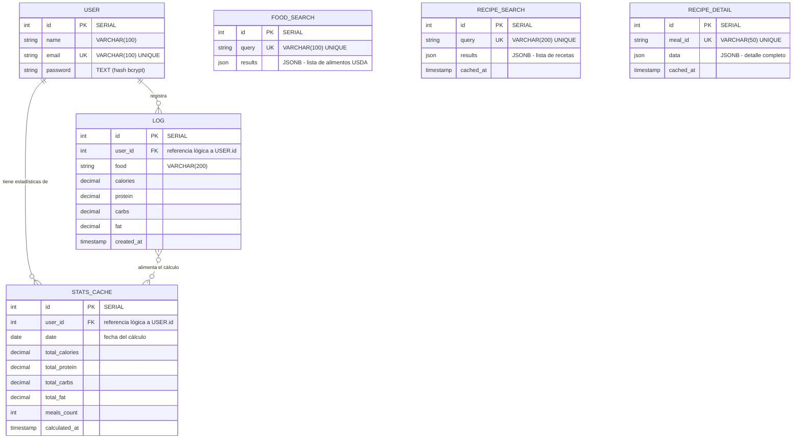
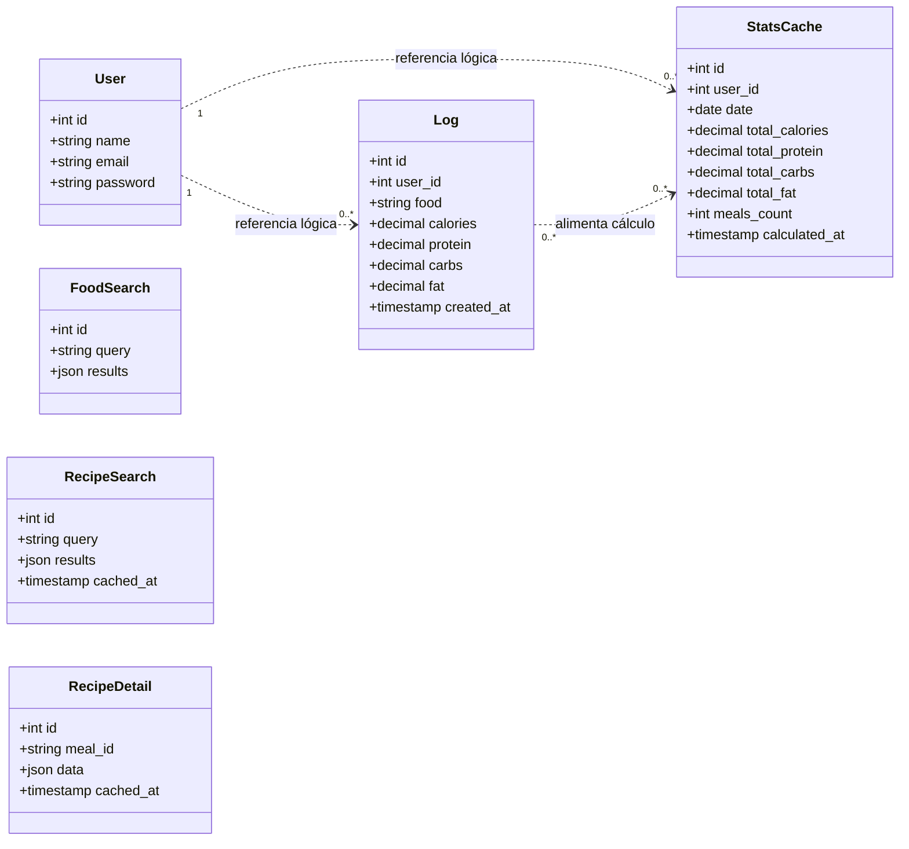

# 🧩 Modelo de Dominio

**Proyecto:** YummyNutrition
**Versión del documento:** 1.0
**Fecha:** Abril 2026

---

## 1. Introducción

Este documento describe el modelo de dominio del sistema YummyNutrition. El modelo de dominio identifica las **entidades** principales que viven en el negocio del sistema, sus **atributos relevantes**, las **relaciones** entre ellas y las **reglas del dominio** que rigen su comportamiento. El modelo se construyó siguiendo los principios de **Domain-Driven Design (DDD)**, dividiendo el sistema en **bounded contexts** que se corresponden uno a uno con cada microservicio.

## 2. Bounded contexts

El sistema está dividido en cinco contextos delimitados, cada uno con su propio modelo de datos, su propia base de datos y su propio servicio. Esta separación garantiza que cada microservicio sea responsable únicamente de las entidades de su dominio y se comunique con los demás únicamente a través de sus interfaces HTTP.

| Bounded Context | Microservicio | Base de datos | Entidades principales |
|-----------------|---------------|---------------|----------------------|
| **Identidad** | auth-service | authdb | User |
| **Catálogo de alimentos** | food-service | fooddb | FoodSearch |
| **Catálogo de recetas** | recipe-service | recipedb | RecipeSearch, RecipeDetail |
| **Registro de consumo** | log-service | logdb | Log |
| **Estadísticas agregadas** | stats-service | statsdb | StatsCache |

## 3. Diagrama del modelo de dominio

El siguiente diagrama presenta las entidades del dominio agrupadas por bounded context, junto con sus atributos clave y las relaciones que mantienen entre sí. Las relaciones entre contextos se muestran como referencias lógicas (no como integridad referencial física, ya que las bases de datos están aisladas).

> **Nota sobre las relaciones FK:** las relaciones marcadas como FK (foreign key) entre `LOG.user_id`, `STATS_CACHE.user_id` y `USER.id` son **referencias lógicas, no físicas**. Al estar cada entidad en una base de datos diferente, PostgreSQL no impone integridad referencial a nivel de motor. La integridad se garantiza a nivel aplicativo: el `user_id` se obtiene exclusivamente del JWT, que solo se emite por el `auth-service` tras autenticación válida.

## 4. Especificación de entidades

A continuación se describe cada entidad del dominio, sus atributos, sus invariantes y las reglas del negocio que la gobiernan.

---

### 4.1 User (Usuario)

| Atributo | Tipo | Descripción |
|----------|------|-------------|
| `id` | int (SERIAL) | Identificador único autogenerado. |
| `name` | string (max 100) | Nombre del usuario para personalización de la interfaz. |
| `email` | string (max 100, único) | Correo electrónico del usuario. Sirve como credencial de login. |
| `password` | string (TEXT) | Hash bcrypt de la contraseña. Nunca se almacena en texto plano. |

**Reglas del dominio:**

- El correo electrónico es único en todo el sistema y funciona como identificador natural.
- La contraseña se cifra con bcrypt usando un factor de costo de 10 antes de persistirse.
- Una vez creado un usuario, su `id` no cambia y se utiliza como referencia lógica en otros bounded contexts.
- Aunque la columna `email` está marcada como única en la base de datos, el sistema valida la unicidad también a nivel aplicativo para entregar mensajes de error claros al cliente.

---

### 4.2 FoodSearch (Búsqueda de alimento cacheada)

| Atributo | Tipo | Descripción |
|----------|------|-------------|
| `id` | int (SERIAL) | Identificador único autogenerado. |
| `query` | string (max 100, único) | Término de búsqueda en minúsculas. |
| `results` | JSONB | Arreglo con los alimentos retornados por USDA, normalizados (nombre, calorías, proteína, carbohidratos, grasas). |

**Reglas del dominio:**

- La entidad funciona como caché transparente entre el sistema y la API de USDA FoodData Central.
- El campo `query` se normaliza a minúsculas antes de almacenarse o consultarse, para que "Banana", "banana" y "BANANA" compartan el mismo registro.
- Al ser caché, esta entidad es eventualmente reemplazable: si se borra, el sistema vuelve a consultarla a USDA y la regenera transparentemente.
- No mantiene relaciones con otras entidades del dominio. Es completamente autónoma dentro del bounded context de catálogo.

---

### 4.3 RecipeSearch (Búsqueda de recetas cacheada)

| Atributo | Tipo | Descripción |
|----------|------|-------------|
| `id` | int (SERIAL) | Identificador único autogenerado. |
| `query` | string (max 200, único) | Término de búsqueda en minúsculas. |
| `results` | JSONB | Arreglo con las recetas encontradas (id de receta, nombre, categoría, área, imagen). |
| `cached_at` | timestamp | Fecha y hora en que la búsqueda fue cacheada. |

**Reglas del dominio:**

- Funciona como caché de la API de TheMealDB para listados de recetas.
- El campo `cached_at` se mantiene como referencia para futuras estrategias de invalidación de caché. Actualmente el sistema no expira el caché, pero el atributo permite implementar TTL si se requiere.

---

### 4.4 RecipeDetail (Detalle de receta cacheado)

| Atributo | Tipo | Descripción |
|----------|------|-------------|
| `id` | int (SERIAL) | Identificador único autogenerado. |
| `meal_id` | string (max 50, único) | Identificador externo de la receta en TheMealDB. |
| `data` | JSONB | Detalle completo: nombre, categoría, área, imagen, instrucciones, lista unificada de ingredientes con cantidades y enlace a YouTube si existe. |
| `cached_at` | timestamp | Fecha y hora del cacheo. |

**Reglas del dominio:**

- TheMealDB entrega los ingredientes en 20 campos separados (`strIngredient1` a `strIngredient20` y `strMeasure1` a `strMeasure20`). El sistema unifica estos campos en una lista única y legible al momento de cachear, no al momento de leer. Esto garantiza que la transformación se haga una sola vez.
- El identificador `meal_id` proviene de TheMealDB y es la clave natural de la entidad.

---

### 4.5 Log (Registro de comida consumida)

| Atributo | Tipo | Descripción |
|----------|------|-------------|
| `id` | int (SERIAL) | Identificador único autogenerado. |
| `user_id` | int | Referencia lógica al `id` del usuario propietario. |
| `food` | string (max 200) | Nombre del alimento o platillo registrado. |
| `calories` | decimal | Calorías consumidas. |
| `protein` | decimal | Gramos de proteína. |
| `carbs` | decimal | Gramos de carbohidratos. |
| `fat` | decimal | Gramos de grasa. |
| `created_at` | timestamp | Fecha y hora del registro, generadas por el servidor. |

**Reglas del dominio:**

- El `user_id` se asigna exclusivamente desde el JWT, no desde el cuerpo de la petición. Esta es la regla de seguridad más importante del bounded context, ya que previene que un usuario pueda registrar comidas a nombre de otro.
- El `created_at` es generado por el servidor en hora local de México (`America/Mexico_City`) para garantizar consistencia con la percepción del usuario al ver "hoy" en el dashboard.
- Un registro solo puede ser eliminado por el usuario que lo creó. La eliminación valida la pertenencia mediante `WHERE id = $1 AND user_id = $2`.
- El sistema no permite editar registros existentes; si el usuario quiere cambiar un registro, debe eliminarlo y crear uno nuevo. Esta decisión simplifica el modelo y evita inconsistencias en los cálculos agregados.

---

### 4.6 StatsCache (Caché de estadísticas agregadas)

| Atributo | Tipo | Descripción |
|----------|------|-------------|
| `id` | int (SERIAL) | Identificador único autogenerado. |
| `user_id` | int | Referencia lógica al `id` del usuario. |
| `date` | date | Fecha del agregado. |
| `total_calories` | decimal | Suma de calorías del usuario en esa fecha. |
| `total_protein` | decimal | Suma de proteína. |
| `total_carbs` | decimal | Suma de carbohidratos. |
| `total_fat` | decimal | Suma de grasas. |
| `meals_count` | int | Número de comidas registradas en esa fecha. |
| `calculated_at` | timestamp | Marca de tiempo del cálculo. |
| **Constraint** | UNIQUE | La combinación `(user_id, date)` es única. |

**Reglas del dominio:**

- Esta entidad es un **caché derivado**: sus valores no son fuente de verdad sino el resultado de procesar registros del bounded context de Log.
- El microservicio de estadísticas obtiene los registros consultando al microservicio de logs **vía HTTP**, nunca accediendo directamente a su base de datos. Esto respeta la frontera del bounded context.
- El cálculo se realiza bajo demanda y se almacena con UPSERT (`INSERT ... ON CONFLICT DO UPDATE`). La unicidad de `(user_id, date)` garantiza que cada usuario tenga una sola fila por día.
- La existencia de esta tabla cumple un doble propósito: acelerar consultas repetidas del dashboard y habilitar el caso de uso CU-11 (historial por día) sin necesidad de recalcular cada vez.

---

## 5. Relaciones entre entidades

El siguiente diagrama de clases simplificado muestra las relaciones lógicas entre las entidades del dominio. Las líneas punteadas representan relaciones que cruzan los bounded contexts (referencias lógicas, no físicas).

## 6. Reglas transversales del dominio

Más allá de las reglas específicas de cada entidad, el sistema tiene tres reglas que aplican al dominio en su conjunto:

**Aislamiento de bases de datos.** Ningún microservicio debe acceder directamente a la base de datos de otro. Si necesita información de otro dominio, debe obtenerla mediante una llamada HTTP al microservicio correspondiente. Esta regla se traduce en el principio de **Database per Service** y es lo que permite que cada bounded context evolucione independientemente.

**Identidad gobernada por el JWT.** Una vez que el `auth-service` emite un JWT, ese token es la única fuente de verdad sobre la identidad del usuario para los demás microservicios. Los servicios protegidos confían en la firma del token y extraen el `id` del usuario directamente de él, sin consultar al `auth-service` en cada petición.

**Caché transparente sobre fuentes externas.** Los datos provenientes de USDA y TheMealDB no son propiedad del sistema; son referenciados desde el sistema. Por eso, las entidades `FoodSearch`, `RecipeSearch` y `RecipeDetail` se modelan como cachés y no como entidades de negocio principales. Esta distinción es importante para entender por qué no se exponen operaciones de modificación sobre ellas.