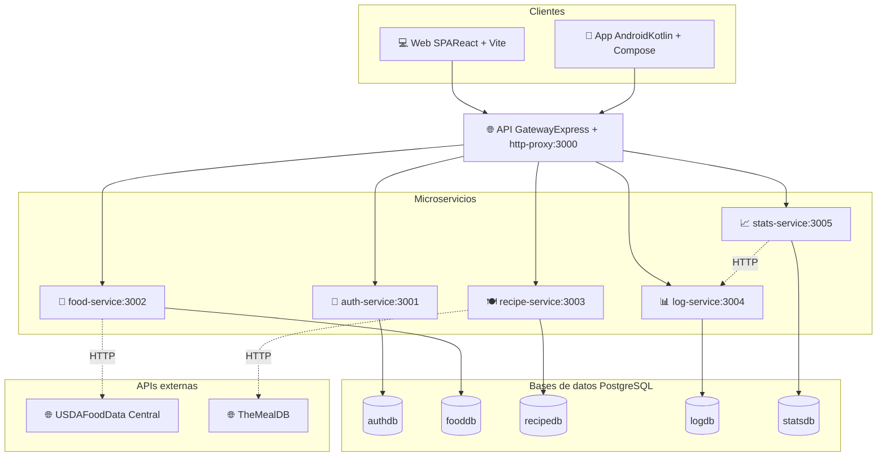
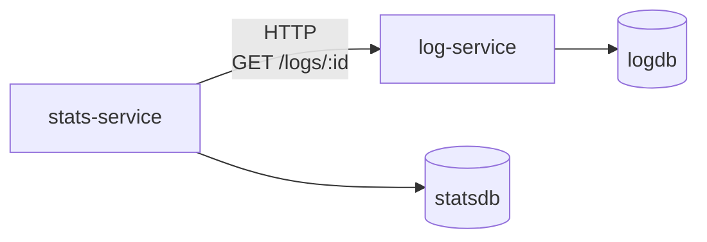

# 🏛️ Diseño de los Servicios

**Proyecto:** YummyNutrition
**Versión del documento:** 1.0
**Fecha:** Abril 2026

---

## 1. Introducción

Este documento describe el diseño detallado de los servicios que componen el sistema YummyNutrition. Se aborda la arquitectura general del sistema, los patrones empleados, la responsabilidad de cada microservicio, sus endpoints, sus dependencias y las decisiones de diseño más relevantes. Este documento es complementario al modelo de dominio descrito en `03-modelo-de-dominio.md` y precede al diseño de la base de datos descrito en `06-diseno-base-datos.md`.

## 2. Arquitectura general del sistema

YummyNutrition implementa una **arquitectura de microservicios** orquestada con Docker Compose, donde cinco servicios independientes de Node.js se comunican entre sí y con los clientes a través de un **API Gateway** centralizado. Cada microservicio es responsable de un único bounded context del dominio, posee su propia base de datos PostgreSQL aislada, y expone una API HTTP REST.

### 2.1 Diagrama de arquitectura

### 2.2 Capas de cada microservicio

Cada microservicio sigue una arquitectura **en capas** que separa responsabilidades:

| Capa | Archivo | Responsabilidad |
|------|---------|-----------------|
| **Servidor** | `server.js` | Punto de entrada. Carga variables de entorno, conecta a la BD y arranca el servidor HTTP. |
| **Aplicación** | `app.js` | Define la app Express, sus rutas, middlewares y handlers. Recibe la conexión a BD por inyección de dependencias para facilitar testing. |
| **Acceso a datos** | `db.js` | Encapsula la conexión a PostgreSQL con política de reintento al arranque. |
| **Pruebas** | `__tests__/` | Tests unitarios con Jest y Supertest, mockeando la base de datos y dependencias externas. |

Esta separación tiene un objetivo claro: **`app.js` es testeable de forma aislada**, sin necesidad de levantar un servidor real ni una base de datos. Los tests inyectan un mock de BD, hacen peticiones HTTP simuladas con Supertest, y validan que la aplicación responde correctamente.

## 3. API Gateway

### 3.1 Responsabilidad

El gateway es el **único punto de entrada al sistema** desde el exterior. Recibe todas las peticiones HTTP de los clientes (web y móvil) y las redirige al microservicio correspondiente. Esto cumple varios propósitos:

- Los clientes no necesitan conocer las URLs internas de los microservicios.
- Los microservicios pueden cambiar de host o puerto sin afectar a los clientes.
- Centraliza el control de tráfico y permite añadir transversalmente capacidades como logging, rate limiting o autenticación si se requiere.
- Aísla la red interna: los microservicios no exponen puertos al host, solo el gateway los expone.

### 3.2 Implementación

El gateway está construido con **Express** y **http-proxy-middleware**. Cada ruta `/api/...` se redirige al microservicio correspondiente:

| Ruta entrante | Servicio destino | URL interna |
|---------------|------------------|-------------|
| `/api/auth/*` | auth-service | `http://auth-service:3001/...` |
| `/api/foods/*` | food-service | `http://food-service:3002/foods/...` |
| `/api/recipes/*` | recipe-service | `http://recipe-service:3003/recipes/...` |
| `/api/logs/*` | log-service | `http://log-service:3004/logs/...` |
| `/api/stats/*` | stats-service | `http://stats-service:3005/stats/...` |

El gateway también expone dos endpoints utilitarios:

- `GET /` — devuelve metadatos del gateway y el listado de servicios disponibles.
- `GET /health` — endpoint de salud para verificación rápida del estado del gateway.

Cualquier ruta que no coincida con los patrones anteriores recibe una respuesta 404 con el path solicitado, facilitando la depuración por parte del cliente.

### 3.3 Middlewares globales

- **CORS** — habilitado para permitir que los clientes web (que viven en otro origen) puedan consumir la API.
- **Morgan** — registra cada petición en consola con su método, ruta, código de respuesta y tiempo. Útil tanto en desarrollo como para depurar problemas de routing.

## 4. auth-service

### 4.1 Responsabilidad

Gestiona la identidad de los usuarios. Es el único microservicio que **emite** tokens JWT. Los demás servicios solo los **validan**.

### 4.2 Endpoints

| Método | Ruta | Descripción | Protegido |
|--------|------|-------------|-----------|
| `GET` | `/` | Health check del servicio | No |
| `POST` | `/register` | Crea una cuenta nueva | No |
| `POST` | `/login` | Autentica y emite JWT | No |
| `GET` | `/profile` | Devuelve datos del JWT actual | Sí |

### 4.3 Detalles técnicos

- **Hashing de contraseñas:** se usa `bcryptjs` con salt rounds 10. Las contraseñas nunca se almacenan ni transmiten en texto plano.
- **Emisión de JWT:** los tokens se firman con HS256 usando el `JWT_SECRET` definido en `docker-compose.yml`. El payload incluye `id`, `email` y `name` del usuario, y tiene una vigencia de 24 horas.
- **Validación de tokens:** un middleware `verificarToken` extrae el token del header `Authorization: Bearer <token>`, lo valida y coloca los datos del usuario en `req.user` para que el handler los use.

### 4.4 Dependencias

| Dependencia | Propósito |
|-------------|-----------|
| `express` | Servidor HTTP y router |
| `cors` | Habilitar peticiones desde otros orígenes |
| `bcryptjs` | Hashing de contraseñas |
| `jsonwebtoken` | Emisión y validación de JWT |
| `pg` | Driver de PostgreSQL |
| `dotenv` | Carga de variables de entorno |

## 5. food-service

### 5.1 Responsabilidad

Provee información nutricional de alimentos. Implementa una estrategia de **caché transparente** sobre la API de USDA FoodData Central: la primera búsqueda de un término consulta a USDA, la guarda en la base de datos local, y todas las búsquedas posteriores del mismo término se sirven desde el caché.

### 5.2 Endpoints

| Método | Ruta | Descripción | Protegido |
|--------|------|-------------|-----------|
| `GET` | `/` | Health check del servicio | No |
| `GET` | `/foods/search?q=<query>` | Busca alimentos por nombre | No |

### 5.3 Estrategia de caché

Recibir query (normalizada a minúsculas y trim)
Consultar tabla foods en fooddb
Si existe registro:
→ Devolver { source: "cache", foods: results }
Si no existe:
→ Consultar API de USDA FoodData Central
→ Normalizar respuesta (extraer name, calories, protein, carbs, fat)
→ INSERT en tabla foods
→ Devolver { source: "usda", foods: results }

### 5.4 Dependencia externa

USDA FoodData Central — `https://api.nal.usda.gov/fdc/v1/foods/search`. La API key se configura en la variable de entorno `USDA_API_KEY`.

## 6. recipe-service

### 6.1 Responsabilidad

Provee información de recetas culinarias. Implementa caché transparente sobre TheMealDB con dos tablas: una para listados de búsqueda y otra para detalles individuales.

### 6.2 Endpoints

| Método | Ruta | Descripción | Protegido |
|--------|------|-------------|-----------|
| `GET` | `/` | Health check del servicio | No |
| `GET` | `/recipes/search?q=<query>` | Busca recetas por nombre | No |
| `GET` | `/recipes/:id` | Obtiene detalle completo de una receta | No |

### 6.3 Procesamiento especial de TheMealDB

TheMealDB devuelve los ingredientes y medidas en 20 pares de campos (`strIngredient1`/`strMeasure1`, `strIngredient2`/`strMeasure2`, etc.). Para entregar al cliente una representación más usable, el servicio fusiona estos campos en una sola lista, descartando entradas vacías y formateando cada ingrediente como `"<medida> <ingrediente>"`. Esta transformación se realiza una única vez al cachear el detalle, no en cada lectura.

### 6.4 Dependencia externa

TheMealDB — `https://www.themealdb.com/api/json/v1/1/`. No requiere API key.

## 7. log-service

### 7.1 Responsabilidad

Gestiona el ciclo de vida de los registros de comidas: creación, consulta y eliminación. Es el servicio donde se materializa la **propiedad** de los datos de un usuario: cada registro está estrictamente vinculado al `id` del usuario que lo creó.

### 7.2 Endpoints

| Método | Ruta | Descripción | Protegido |
|--------|------|-------------|-----------|
| `GET` | `/` | Health check del servicio | No |
| `POST` | `/logs` | Crea un nuevo registro de comida | Sí |
| `GET` | `/logs` | Devuelve el historial del usuario autenticado | Sí |
| `DELETE` | `/logs/:id` | Elimina un registro propio | Sí |
| `GET` | `/logs/:userId` | Endpoint interno: registros de cualquier usuario | No (uso interno) |

### 7.3 Decisiones de seguridad

**Extracción del `user_id` desde el JWT.** El servicio NUNCA acepta `user_id` en el cuerpo de la petición. Lo extrae del token JWT validado por el middleware. Esto previene que un usuario pueda crear o consultar datos de otro suplantándolo en el body.

**Validación de pertenencia en `DELETE`.** La eliminación se realiza con `DELETE FROM logs WHERE id = $1 AND user_id = $2`, garantizando que un usuario solo pueda borrar sus propios registros. Si la query no afecta filas, se responde con 404 sin revelar si el registro existe pero pertenece a otro usuario.

### 7.4 Endpoint interno (`GET /logs/:userId`)

Este endpoint **no está protegido por JWT** y es consumido por `stats-service` a través de la red Docker interna. Aunque el gateway lo enruta también, en una versión productiva conviene restringirlo a tráfico interno mediante un token de servicio compartido. Esta deuda técnica está documentada para futuras iteraciones.

## 8. stats-service

### 8.1 Responsabilidad

Calcula estadísticas agregadas a partir de los registros de comidas. Es el ejemplo más claro de un microservicio que **respeta el bounded context** de otro: en lugar de leer directamente la base de datos `logdb`, consulta al `log-service` mediante HTTP.

### 8.2 Endpoints

| Método | Ruta | Descripción | Protegido |
|--------|------|-------------|-----------|
| `GET` | `/` | Health check del servicio | No |
| `GET` | `/stats/:userId` | Totales nutricionales del día actual | Sí |
| `GET` | `/stats/:userId/history?days=N` | Historial de totales por día | Sí |

### 8.3 Algoritmo de cálculo del día actual

Validar token JWT
Obtener todos los logs del usuario solicitado mediante HTTP
GET http://log-service:3004/logs/:userId
Filtrar los logs cuya fecha (en hora local) coincida con HOY
Reducir los logs filtrados sumando calorías, proteína, carbs y grasas
Hacer UPSERT en stats_cache con la pareja (user_id, date) como única
Devolver los totales redondeados a 2 decimales

### 8.4 Manejo de fechas

El cálculo de "hoy" requiere especial cuidado porque los timestamps de los registros están en hora local (`America/Mexico_City`). Para esto:

- Todos los contenedores del sistema están configurados con la zona horaria de México mediante la variable `TZ=America/Mexico_City` en `docker-compose.yml` y la instalación del paquete `tzdata` en los Dockerfiles Alpine.
- El servicio usa una función helper `getLocalDateString(date)` que formatea la fecha como `YYYY-MM-DD` en la zona local del contenedor, evitando el uso de `toISOString()` (que devolvería UTC y causaría desfase de 6 horas).

### 8.5 Comunicación con log-service

Esta comunicación HTTP en lugar de acceso directo a BD es **deliberada** y respeta el principio de bounded context. Aunque sea ligeramente más lenta que un acceso directo, garantiza que `log-service` mantenga la responsabilidad exclusiva sobre sus datos.

## 9. Patrones de diseño aplicados

### 9.1 Database per Service

Cada microservicio posee su propia instancia de PostgreSQL. Ninguna BD es compartida. Esto permite:

- **Evolución independiente:** cambiar el esquema de `logdb` no afecta a `stats-service` mientras la API HTTP mantenga su contrato.
- **Escalabilidad:** cada BD puede dimensionarse según la carga de su servicio.
- **Aislamiento de fallos:** un fallo en una BD solo afecta a su servicio, no propaga al resto del sistema.

### 9.2 API Gateway

Centraliza el acceso desde clientes externos. Los clientes solo conocen la URL del gateway. Las URLs internas de los microservicios pueden cambiar sin afectar a los clientes.

### 9.3 Inyección de dependencias

La función `createApp(db)` recibe la conexión a la base de datos como parámetro. Esto permite que los tests inyecten un mock de BD sin tocar PostgreSQL real, acelerando la suite de pruebas y haciéndola determinista.

### 9.4 Caché transparente

Los servicios `food-service`, `recipe-service` y `stats-service` cachean datos en sus propias bases de datos. La caché es transparente para el cliente: la respuesta indica con un campo `source` si los datos vienen del caché o de la fuente original.

### 9.5 Resiliencia en el arranque

`db.js` implementa una política de reintento (`connectWithRetry`) que intenta conectarse a PostgreSQL hasta 10 veces con espera de 3 segundos entre intentos. Esto permite que `docker compose up` arranque correctamente aunque las BDs tarden en estar listas.

## 10. Comunicación entre servicios

| Origen | Destino | Protocolo | Propósito |
|--------|---------|-----------|-----------|
| Clientes (web, móvil) | gateway | HTTP/REST | Entrada al sistema |
| gateway | auth-service | HTTP (proxy) | Reenvío de auth |
| gateway | food-service | HTTP (proxy) | Reenvío de búsquedas de alimento |
| gateway | recipe-service | HTTP (proxy) | Reenvío de búsquedas de recetas |
| gateway | log-service | HTTP (proxy) | Reenvío de operaciones sobre logs |
| gateway | stats-service | HTTP (proxy) | Reenvío de estadísticas |
| stats-service | log-service | HTTP directo | Obtener logs para calcular agregados |
| food-service | USDA FoodData Central | HTTPS | Información de alimentos |
| recipe-service | TheMealDB | HTTPS | Información de recetas |
| Cualquier servicio | Su propia BD | TCP (pg) | Persistencia de su dominio |

Toda la comunicación interna entre contenedores ocurre dentro de la red Docker `yummy-net`. Los nombres de los contenedores funcionan como hostnames (por ejemplo, `auth-service` o `log-service`).

## 11. Configuración por variables de entorno

Todos los datos sensibles y configuraciones específicas del entorno se inyectan a través de variables definidas en `docker-compose.yml`:

| Variable | Servicios | Descripción |
|----------|-----------|-------------|
| `PORT` | Todos | Puerto interno del servicio |
| `JWT_SECRET` | auth, log, stats | Secreto compartido para firmar y validar JWT |
| `DB_HOST`, `DB_PORT`, `DB_USER`, `DB_PASSWORD`, `DB_NAME` | Todos | Conexión a la BD propia |
| `USDA_API_KEY` | food-service | Llave de API de USDA |
| `LOG_SERVICE_URL` | stats-service | URL del log-service para llamadas internas |
| `TZ` | Todos | Zona horaria del contenedor |

Esta práctica cumple con el principio **Twelve-Factor App** de configuración mediante entorno.

## 12. Resumen de responsabilidades

| Microservicio | Bounded Context | Lectura externa | Escritura externa | Cache propio |
|---------------|-----------------|-----------------|-------------------|--------------|
| auth-service | Identidad | — | — | No |
| food-service | Catálogo de alimentos | USDA | — | Sí (búsquedas) |
| recipe-service | Catálogo de recetas | TheMealDB | — | Sí (búsquedas y detalles) |
| log-service | Registro de consumo | — | — | No |
| stats-service | Estadísticas | log-service (HTTP) | — | Sí (agregados diarios) |
| gateway | Routing | — | — | No |