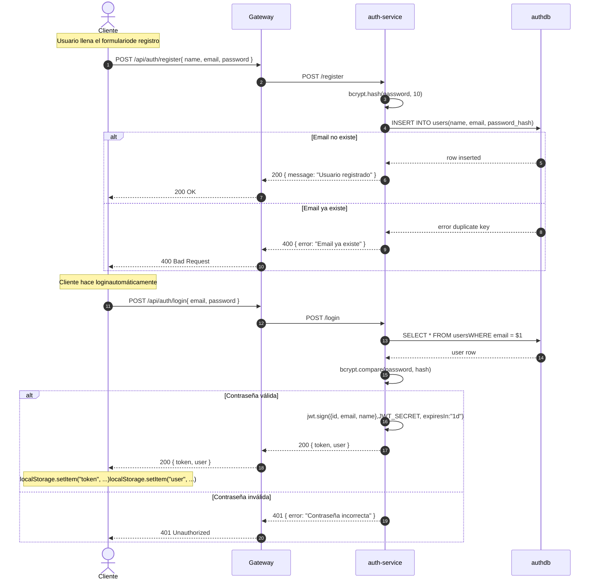
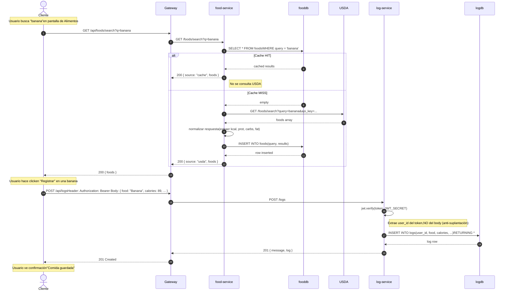
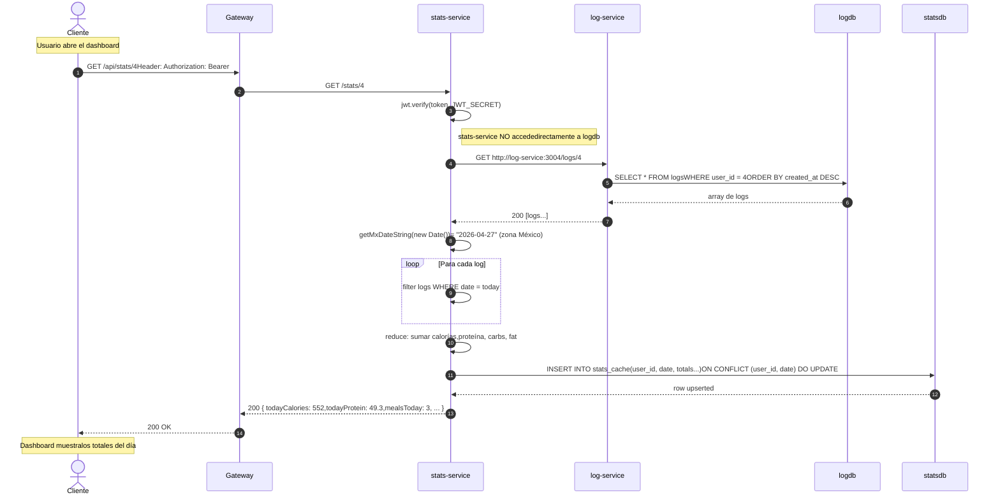
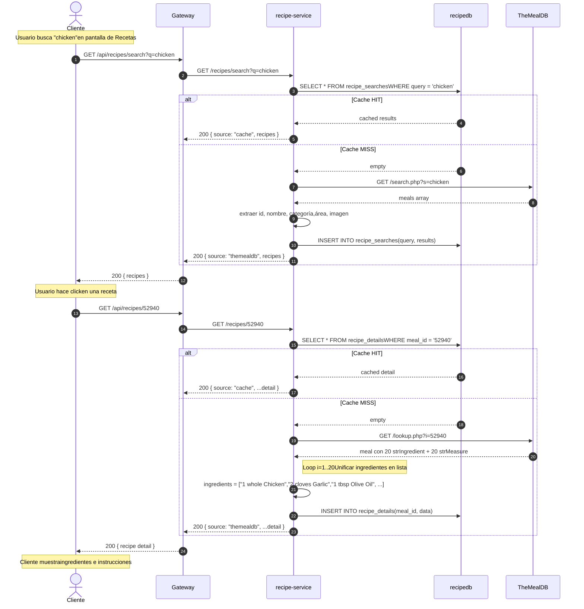
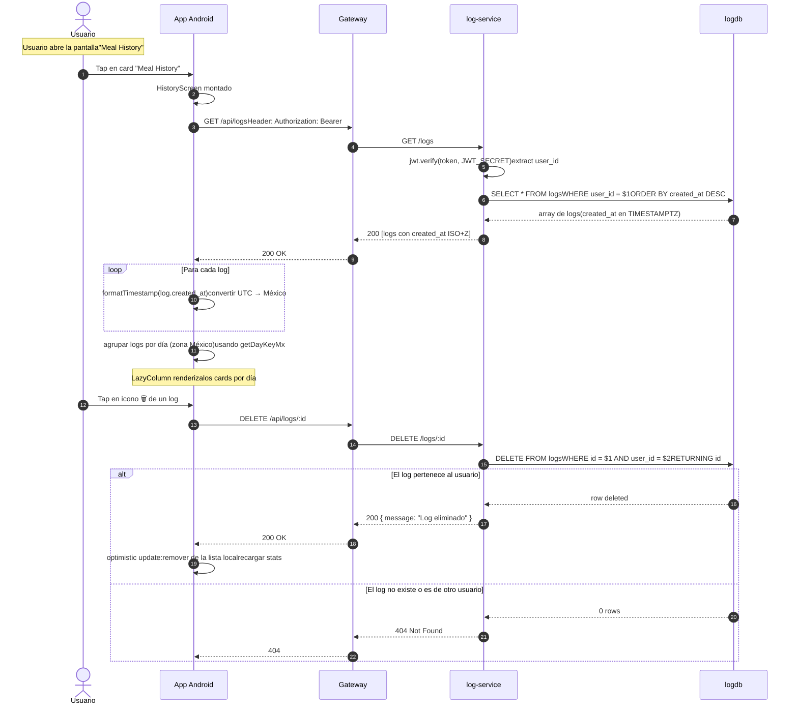

# 🔄 Diagramas de Secuencia

**Proyecto:** YummyNutrition
**Versión del documento:** 1.0
**Fecha:** Abril 2026

---

## 1. Introducción

Este documento presenta los diagramas de secuencia que describen los flujos más representativos del sistema YummyNutrition. Cada diagrama ilustra cómo viaja una petición desde el cliente, atraviesa el API Gateway, llega al microservicio correspondiente, interactúa con la base de datos o con servicios externos, y devuelve la respuesta.

Los diagramas elegidos cubren los tres flujos críticos del sistema:

1. **Autenticación**: registro y login de un usuario.
2. **Registro nutricional**: búsqueda de un alimento y registro del consumo.
3. **Consulta de estadísticas**: cálculo de los totales nutricionales del día.
4. **Búsqueda de receta con detalle**: consulta a una API externa con caché transparente.

Cada diagrama está acompañado de una descripción narrativa del flujo y notas técnicas relevantes para su comprensión y defensa.

## 2. Convenciones de los diagramas

A lo largo de los diagramas se utilizan las siguientes convenciones:

| Símbolo | Significado |
|---------|-------------|
| Línea sólida con flecha | Petición síncrona (HTTP, query SQL) |
| Línea punteada con flecha | Respuesta de una petición previa |
| Caja `Note` | Comentario explicativo de un paso |
| Caja `alt` | Flujo alternativo (ej. error 404) |
| Caja `loop` | Repetición de pasos |

Los actores representados son:

- **Cliente** (Web SPA o App Android)
- **Gateway** (API Gateway)
- **Microservicios** (auth, food, recipe, log, stats)
- **Bases de datos** (authdb, fooddb, recipedb, logdb, statsdb)
- **APIs externas** (USDA FoodData Central, TheMealDB)

## 3. Flujo 1 — Registro y autenticación de un usuario

### 3.1 Descripción

Este flujo cubre dos casos de uso encadenados: **CU-01 Registrarse** y **CU-02 Iniciar sesión**. Cuando un usuario se registra exitosamente, el sistema lo autentica de forma automática emitiéndole un JWT, evitando que tenga que volver a ingresar credenciales inmediatamente.

El cliente almacena dos valores en `localStorage`: el token JWT y los datos públicos del usuario (id, nombre, email). Estos valores se utilizan en todas las peticiones subsecuentes para identificar al usuario.

### 3.2 Diagrama

### 3.3 Notas técnicas

- El JWT se firma con HMAC-SHA256 usando el secreto compartido `JWT_SECRET` definido en `docker-compose.yml`. Este mismo secreto lo usan `log-service` y `stats-service` para validar tokens.
- La contraseña se cifra con `bcrypt` usando un factor de costo de 10. Este valor balancea seguridad y rendimiento (un hash tarda aproximadamente 100 ms en hardware moderno).
- El registro y el login son los únicos endpoints **no protegidos** del sistema, junto con las búsquedas en `food-service` y `recipe-service`.

---

## 4. Flujo 2 — Registro nutricional con búsqueda de alimento

### 4.1 Descripción

Este es el flujo de uso principal del sistema. Cubre los casos de uso **CU-04 Buscar alimento** y **CU-07 Registrar comida** ejecutados secuencialmente. Demuestra dos características técnicas importantes:

- **Caché transparente**: la búsqueda primero verifica si el término ya fue buscado antes; si es así, responde sin contactar a USDA. Esto reduce la latencia y el consumo de cuota de la API externa.
- **Identidad gobernada por JWT**: al registrar la comida, el `user_id` se extrae exclusivamente del token, ignorando cualquier valor que pudiera enviarse en el cuerpo de la petición.

### 4.2 Diagrama

### 4.3 Notas técnicas

- El caché se identifica por el término de búsqueda **normalizado a minúsculas y sin espacios al inicio o final**. Esto significa que `"Banana"`, `"banana"` y `" banana "` resultan en el mismo registro de caché.
- Si la API de USDA falla y no hay caché, el servicio responde con error 500 controlado. El cliente muestra un mensaje al usuario sin colapsar.
- El campo `created_at` del log es de tipo `TIMESTAMPTZ` y se genera con `NOW()` de PostgreSQL, que internamente almacena el valor en UTC. La conversión a hora local de México (`America/Mexico_City`) se realiza en el cliente al momento de mostrar la fecha al usuario, mediante helpers de zona horaria fija. Este enfoque garantiza que un mismo registro se vea con la hora correcta sin importar la zona configurada en el navegador, el emulador Android o el contenedor del backend.

---

## 5. Flujo 3 — Consulta de estadísticas del día

### 5.1 Descripción

Este flujo cubre el caso de uso **CU-10 Ver totales del día** y es uno de los flujos más interesantes del sistema desde el punto de vista arquitectónico. Demuestra el principio de **bounded context con comunicación HTTP entre microservicios**.

El microservicio `stats-service` necesita los registros del usuario para calcular los totales, pero **no accede directamente** a la base de datos `logdb`. En su lugar, consulta al `log-service` mediante una llamada HTTP interna dentro de la red Docker. Esta decisión preserva la responsabilidad exclusiva de cada microservicio sobre sus datos.

Adicionalmente, el resultado del cálculo se cachea en `statsdb` con UPSERT (`INSERT ... ON CONFLICT DO UPDATE`) para acelerar consultas repetidas y para construir el historial por día (CU-11) sin tener que recalcular.

### 5.2 Diagrama

### 5.3 Notas técnicas

- El endpoint `GET /logs/:userId` en `log-service` está disponible internamente para que `stats-service` lo consuma. En una iteración futura conviene protegerlo con un token de servicio compartido para evitar que también sea accesible públicamente vía gateway.
- La función `getMxDateString(date)` construye una cadena `YYYY-MM-DD` usando `Intl.DateTimeFormat` con `timeZone: 'America/Mexico_City'`. Este enfoque garantiza que "hoy" se calcule siempre en zona México sin depender de la zona configurada en el contenedor, lo que hace el cálculo robusto frente a despliegues en hosts con cualquier configuración regional.
- El `UPSERT` con la constraint UNIQUE `(user_id, date)` hace que cada usuario tenga exactamente una fila por día en `stats_cache`. Las consultas posteriores actualizan la fila en lugar de duplicarla.

---

## 6. Flujo 4 — Búsqueda y consulta de receta con caché

### 6.1 Descripción

Este flujo cubre los casos de uso **CU-05 Buscar recetas** y **CU-06 Ver detalle de receta**. Es un buen ejemplo de cómo se manejan las dos APIs externas del sistema con caché transparente independiente para listados y para detalles.

Una característica técnica interesante de este flujo es el **procesamiento de los 20 campos de ingredientes** que TheMealDB devuelve por separado. El sistema los unifica en una lista única y legible al momento de cachear, no al momento de leer. Esto garantiza que la transformación se realice una sola vez por receta.

### 6.2 Diagrama

### 6.3 Notas técnicas

- TheMealDB devuelve los ingredientes en un formato peculiar con 20 campos separados (`strIngredient1` ... `strIngredient20` y `strMeasure1` ... `strMeasure20`). Muchos están vacíos o nulos. El código del servicio itera con un `for` de 1 a 20, descarta los vacíos, y une medida + ingrediente en strings legibles.
- El caché de búsqueda y el caché de detalle son tablas separadas (`recipe_searches` y `recipe_details`). Esto es deliberado: una búsqueda de "chicken" puede traer N recetas, pero el detalle de cada receta se cachea de forma independiente bajo su propio `meal_id`.

---

## 7. Flujo 5 — Consulta de historial completo (cliente Android)

### 7.1 Descripción

Este flujo cubre el caso de uso **CU-08 Consultar historial** ejecutado desde la app Android. Es equivalente al flujo de la web, pero ilustra una característica importante del cliente móvil: el manejo explícito de la zona horaria al renderizar las marcas de tiempo recibidas del backend.

El backend envía cada `created_at` en formato ISO-8601 con sufijo UTC (`Z`). El cliente Android, mediante un helper basado en `java.time` (`OffsetDateTime` y `ZoneId.of("America/Mexico_City")`), convierte cada timestamp a hora México antes de mostrarlo. Esto garantiza que la pantalla de historial muestre la misma hora que la web, independientemente de la zona configurada en el dispositivo o el emulador.

### 7.2 Diagrama

### 7.3 Notas técnicas

- El cliente Android usa `OffsetDateTime.parse()` para interpretar el timestamp del backend. Este parser reconoce automáticamente el sufijo `Z` (UTC) o cualquier offset explícito como `-06:00`. Tras parsear, `atZoneSameInstant(ZoneId.of("America/Mexico_City"))` realiza la conversión a hora local del negocio.
- La agrupación por día utiliza un helper `getDayKeyMx` que devuelve la clave `YYYY-MM-DD` en zona México, evitando que un registro hecho a las 23:30 hora local aparezca bajo el día siguiente UTC.
- La eliminación es **optimista** en el cliente: la fila se retira de la lista antes de recibir confirmación del servidor. Si el servidor responde con error, se podría revertir el cambio (mejora pendiente para iteración futura).
- Tras una eliminación exitosa, el cliente recarga las estadísticas del día llamando a `GET /api/stats/:userId`, lo que mantiene el dashboard sincronizado con el historial.

---

## 8. Resumen de patrones observables en los flujos

Los cuatro diagramas anteriores muestran de forma concreta varios patrones arquitectónicos discutidos en el documento `04-diseno-servicios.md`:

| Patrón | Flujos donde aparece |
|--------|---------------------|
| **API Gateway centralizado** | 1, 2, 3, 4 (todas las peticiones del cliente entran por aquí) |
| **JWT como fuente única de identidad** | 1 (emisión), 2 (validación en log-service), 3 (validación en stats-service) |
| **Caché transparente sobre fuente externa** | 2 (food-service ↔ USDA), 4 (recipe-service ↔ TheMealDB) |
| **Comunicación HTTP entre microservicios** | 3 (stats-service consume log-service), 5 (cliente Android consume log-service vía gateway) |
| **Zona horaria fijada en el cliente** | 3 (`Intl.DateTimeFormat` en stats-service), 5 (`ZoneId.of("America/Mexico_City")` en Android) |
| **UPSERT para garantizar unicidad lógica** | 3 (stats_cache con `(user_id, date)`) |
| **Transformación al cachear** | 4 (unificación de 20 campos de ingredientes) |

Estos patrones son los que dan al sistema sus propiedades de **escalabilidad** (cada servicio cachea independientemente), **seguridad** (JWT como autoridad central de identidad) y **mantenibilidad** (cada microservicio puede evolucionar sin afectar a los demás mientras mantenga su contrato de API).