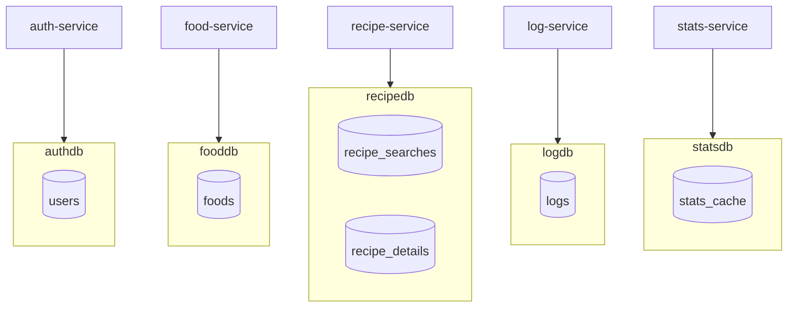

# 🗄️ Diseño de la Base de Datos

**Proyecto:** YummyNutrition
**Versión del documento:** 1.0
**Fecha:** Abril 2026

---

## 1. Introducción

Este documento describe el diseño físico de las bases de datos del sistema YummyNutrition. A diferencia del modelo de dominio descrito en `03-modelo-de-dominio.md` (que se enfoca en los conceptos del negocio), este documento se centra en los detalles concretos de implementación: motor de base de datos, tipos de columna, constraints, llaves primarias, índices, configuración de los contenedores y estrategia de persistencia.

## 2. Decisiones arquitectónicas de almacenamiento

### 2.1 Motor de base de datos

Se eligió **PostgreSQL 16** como motor de base de datos para todos los microservicios. Las razones de esta elección son:

- **Soporte nativo de JSONB**: tres de los cinco microservicios (`food-service`, `recipe-service`) cachean respuestas estructuradas de APIs externas. JSONB permite almacenar y consultar estos documentos de forma eficiente sin necesidad de schemas rígidos.
- **Tipos de fecha y timestamp robustos**: el sistema necesita distinguir entre fechas (`DATE`) y momentos puntuales (`TIMESTAMP`), y PostgreSQL ofrece soporte completo para ambos.
- **Constraints de integridad**: PostgreSQL implementa correctamente constraints `UNIQUE` compuestas, indispensables para tablas como `stats_cache` que requieren unicidad sobre `(user_id, date)`.
- **Estabilidad y madurez**: PostgreSQL 16 es una versión LTS con amplia documentación y comunidad activa.

### 2.2 Database per Service

Como se documenta en `04-diseno-servicios.md`, cada microservicio posee su propia instancia de PostgreSQL. No existe una base de datos compartida. Esta decisión arquitectónica tiene implicaciones directas en el diseño físico:

- Cada base de datos vive en un contenedor Docker independiente.
- Las relaciones entre entidades de bounded contexts diferentes (por ejemplo, `LOG.user_id` referenciando a `USER.id`) son **referencias lógicas**, no constraints físicos. PostgreSQL no impone integridad referencial entre bases de datos distintas.
- La integridad referencial se garantiza a nivel aplicativo: el `user_id` se obtiene exclusivamente del JWT firmado por `auth-service`, lo que garantiza que solo IDs de usuarios reales pueden aparecer en `LOG` y `STATS_CACHE`.

### 2.3 Persistencia con volúmenes Docker

Cada base de datos utiliza un volumen Docker dedicado para garantizar persistencia entre reinicios:

| Volumen Docker | Base de datos |
|----------------|---------------|
| `auth-data` | authdb |
| `food-data` | fooddb |
| `recipe-data` | recipedb |
| `log-data` | logdb |
| `stats-data` | statsdb |

Los volúmenes se montan en `/var/lib/postgresql/data` dentro del contenedor. Al ejecutar `docker compose down`, los datos persisten. Solo `docker compose down -v` los elimina (operación de reset total).

## 3. Mapa global de las bases de datos



## 4. Esquema de cada base de datos

### 4.1 authdb — Tabla `users`

Almacena las cuentas de usuario del sistema.

```sql
CREATE TABLE IF NOT EXISTS users (
  id       SERIAL PRIMARY KEY,
  name     VARCHAR(100),
  email    VARCHAR(100) UNIQUE,
  password TEXT
);
```

**Columnas:**

| Columna | Tipo | Constraints | Descripción |
|---------|------|-------------|-------------|
| `id` | `SERIAL` | PRIMARY KEY | Identificador único autogenerado. |
| `name` | `VARCHAR(100)` | — | Nombre del usuario. |
| `email` | `VARCHAR(100)` | UNIQUE | Correo electrónico, también credencial de login. |
| `password` | `TEXT` | — | Hash bcrypt de la contraseña (60 caracteres en formato `$2a$10$...`). |

**Índices:**

- Índice automático sobre `id` (PRIMARY KEY).
- Índice automático sobre `email` (UNIQUE constraint).

**Notas de diseño:**

- El campo `password` usa tipo `TEXT` en lugar de `VARCHAR(60)` para no asumir un tamaño fijo. Aunque bcrypt produce hashes de 60 caracteres, esta decisión deja margen para migrar a algoritmos como Argon2 sin alterar el esquema.
- El constraint `UNIQUE` sobre `email` es la garantía física de que dos usuarios no pueden tener el mismo correo. La aplicación lo valida también para entregar mensajes de error legibles.

---

### 4.2 fooddb — Tabla `foods`

Cache de búsquedas de alimentos en USDA FoodData Central.

```sql
CREATE TABLE IF NOT EXISTS foods (
  id      SERIAL PRIMARY KEY,
  query   VARCHAR(100) UNIQUE,
  results JSONB
);
```

**Columnas:**

| Columna | Tipo | Constraints | Descripción |
|---------|------|-------------|-------------|
| `id` | `SERIAL` | PRIMARY KEY | Identificador único autogenerado. |
| `query` | `VARCHAR(100)` | UNIQUE | Término de búsqueda normalizado a minúsculas. |
| `results` | `JSONB` | — | Arreglo de alimentos retornados por USDA con campos normalizados. |

**Índices:**

- Índice automático sobre `id` (PRIMARY KEY).
- Índice automático sobre `query` (UNIQUE constraint).

**Estructura del JSONB `results`:**

```json
[
  {
    "fdcId": 1105314,
    "name": "BANANA",
    "brand": null,
    "category": "Fruits",
    "dataType": "SR Legacy",
    "servingSize": 100,
    "servingUnit": "g",
    "calories": 89,
    "protein": 1.1,
    "carbs": 22.8,
    "fat": 0.3
  }
]
```

**Notas de diseño:**

- `JSONB` se prefiere sobre `JSON` porque permite indexar campos individuales si en el futuro se requiere búsqueda por contenido del documento.
- Cada query produce un único registro. Si en el futuro se necesita expirar el caché, basta con agregar una columna `cached_at TIMESTAMP DEFAULT CURRENT_TIMESTAMP` y un job que limpie registros antiguos.

---

### 4.3 recipedb — Tablas `recipe_searches` y `recipe_details`

Cache de búsquedas y detalles individuales de recetas en TheMealDB.

```sql
CREATE TABLE IF NOT EXISTS recipe_searches (
  id        SERIAL PRIMARY KEY,
  query     VARCHAR(200) UNIQUE NOT NULL,
  results   JSONB NOT NULL,
  cached_at TIMESTAMP DEFAULT CURRENT_TIMESTAMP
);

CREATE TABLE IF NOT EXISTS recipe_details (
  id        SERIAL PRIMARY KEY,
  meal_id   VARCHAR(50) UNIQUE NOT NULL,
  data      JSONB NOT NULL,
  cached_at TIMESTAMP DEFAULT CURRENT_TIMESTAMP
);
```

**Tabla `recipe_searches`:**

| Columna | Tipo | Constraints | Descripción |
|---------|------|-------------|-------------|
| `id` | `SERIAL` | PRIMARY KEY | Identificador único autogenerado. |
| `query` | `VARCHAR(200)` | UNIQUE NOT NULL | Término de búsqueda normalizado. |
| `results` | `JSONB` | NOT NULL | Arreglo de recetas (id, nombre, categoría, área, imagen). |
| `cached_at` | `TIMESTAMP` | DEFAULT CURRENT_TIMESTAMP | Marca temporal del cacheo. |

**Tabla `recipe_details`:**

| Columna | Tipo | Constraints | Descripción |
|---------|------|-------------|-------------|
| `id` | `SERIAL` | PRIMARY KEY | Identificador único autogenerado. |
| `meal_id` | `VARCHAR(50)` | UNIQUE NOT NULL | Identificador externo de la receta en TheMealDB. |
| `data` | `JSONB` | NOT NULL | Detalle completo de la receta. |
| `cached_at` | `TIMESTAMP` | DEFAULT CURRENT_TIMESTAMP | Marca temporal del cacheo. |

**Estructura del JSONB `data` en `recipe_details`:**

```json
{
  "id": "52940",
  "name": "Brown Stew Chicken",
  "category": "Chicken",
  "area": "Jamaican",
  "image": "https://www.themealdb.com/images/media/meals/...",
  "instructions": "Season chicken with salt, pepper...",
  "ingredients": [
    "1 whole Chicken",
    "2 cloves Garlic",
    "1 tbsp Olive Oil"
  ],
  "youtube": "https://www.youtube.com/watch?v=..."
}
```

**Notas de diseño:**

- Las dos tablas son independientes porque sirven a propósitos distintos: `recipe_searches` cachea listados de búsqueda, `recipe_details` cachea recetas individuales completas.
- El campo `ingredients` dentro del JSONB es una lista de strings ya formateados. Esta unificación se hace al momento de cachear, no al momento de leer, para evitar trabajo redundante.
- `meal_id` es un `VARCHAR(50)` y no un `INTEGER` porque TheMealDB lo entrega como string, y se preserva ese formato para evitar conversiones innecesarias.

---

### 4.4 logdb — Tabla `logs`

Almacena los registros de comidas consumidas por los usuarios.

```sql
CREATE TABLE IF NOT EXISTS logs (
  id         SERIAL PRIMARY KEY,
  user_id    INT NOT NULL,
  food       VARCHAR(200) NOT NULL,
  calories   NUMERIC,
  protein    NUMERIC,
  carbs      NUMERIC,
  fat        NUMERIC,
  created_at TIMESTAMP DEFAULT CURRENT_TIMESTAMP
);
```

**Columnas:**

| Columna | Tipo | Constraints | Descripción |
|---------|------|-------------|-------------|
| `id` | `SERIAL` | PRIMARY KEY | Identificador único autogenerado. |
| `user_id` | `INT` | NOT NULL | Referencia lógica al `id` del usuario en `authdb.users`. |
| `food` | `VARCHAR(200)` | NOT NULL | Nombre del alimento o platillo registrado. |
| `calories` | `NUMERIC` | — | Calorías consumidas. |
| `protein` | `NUMERIC` | — | Gramos de proteína. |
| `carbs` | `NUMERIC` | — | Gramos de carbohidratos. |
| `fat` | `NUMERIC` | — | Gramos de grasa. |
| `created_at` | `TIMESTAMP` | DEFAULT CURRENT_TIMESTAMP | Fecha y hora del registro generadas por el servidor. |

**Índices:**

- Índice automático sobre `id` (PRIMARY KEY).

**Índices recomendados para iteraciones futuras:**

- `CREATE INDEX idx_logs_user_id ON logs(user_id);` para acelerar consultas filtradas por usuario.
- `CREATE INDEX idx_logs_user_date ON logs(user_id, created_at DESC);` para acelerar las consultas de historial ordenado.

**Notas de diseño:**

- El tipo `NUMERIC` se utiliza para los valores nutricionales en lugar de `FLOAT` o `REAL` para mantener precisión decimal exacta. Esto es importante porque las sumas agregadas en `stats-service` no acumulan errores de precisión.
- El `user_id` no es FOREIGN KEY a `authdb.users.id` porque las dos tablas viven en bases de datos diferentes. La integridad se garantiza a nivel aplicativo.
- El timestamp se almacena en hora local del contenedor (`America/Mexico_City`), no en UTC. Esto se decide por consistencia con la percepción del usuario al ver "hoy" en el dashboard.

---

### 4.5 statsdb — Tabla `stats_cache`

Cache de los totales nutricionales precalculados por usuario y por día.

```sql
CREATE TABLE IF NOT EXISTS stats_cache (
  id             SERIAL PRIMARY KEY,
  user_id        INT NOT NULL,
  date           DATE NOT NULL,
  total_calories NUMERIC DEFAULT 0,
  total_protein  NUMERIC DEFAULT 0,
  total_carbs    NUMERIC DEFAULT 0,
  total_fat      NUMERIC DEFAULT 0,
  meals_count    INT DEFAULT 0,
  calculated_at  TIMESTAMP DEFAULT CURRENT_TIMESTAMP,
  UNIQUE(user_id, date)
);
```

**Columnas:**

| Columna | Tipo | Constraints | Descripción |
|---------|------|-------------|-------------|
| `id` | `SERIAL` | PRIMARY KEY | Identificador único autogenerado. |
| `user_id` | `INT` | NOT NULL | Referencia lógica al `id` del usuario. |
| `date` | `DATE` | NOT NULL | Fecha del cálculo (sin componente de hora). |
| `total_calories` | `NUMERIC` | DEFAULT 0 | Suma de calorías en la fecha. |
| `total_protein` | `NUMERIC` | DEFAULT 0 | Suma de proteína. |
| `total_carbs` | `NUMERIC` | DEFAULT 0 | Suma de carbohidratos. |
| `total_fat` | `NUMERIC` | DEFAULT 0 | Suma de grasas. |
| `meals_count` | `INT` | DEFAULT 0 | Número de comidas registradas en la fecha. |
| `calculated_at` | `TIMESTAMP` | DEFAULT CURRENT_TIMESTAMP | Marca temporal del último cálculo. |
| **Constraint compuesta** | UNIQUE | `(user_id, date)` | Garantiza una sola fila por usuario por día. |

**Índices:**

- Índice automático sobre `id` (PRIMARY KEY).
- Índice automático sobre `(user_id, date)` (UNIQUE constraint).

**Notas de diseño:**

- La constraint compuesta `UNIQUE(user_id, date)` es crítica para el funcionamiento del UPSERT. Permite que `INSERT ... ON CONFLICT (user_id, date) DO UPDATE` actualice la fila existente en lugar de duplicarla.
- El tipo `DATE` (no `TIMESTAMP`) se usa porque el cálculo es siempre por día completo. No tiene sentido almacenar la hora.
- Esta tabla es **caché derivado**: sus datos pueden reconstruirse en cualquier momento consultando `logdb` y recalculando. Por eso no es una pérdida si se trunca esta tabla durante operaciones de mantenimiento (de hecho, es necesario truncarla cuando cambian los logs históricamente).

## 5. Configuración de los contenedores PostgreSQL

Cada contenedor de PostgreSQL se configura con las siguientes variables de entorno en `docker-compose.yml`:

| Variable | Valor | Descripción |
|----------|-------|-------------|
| `POSTGRES_USER` | `postgres` | Usuario administrador. |
| `POSTGRES_PASSWORD` | `1234` | Contraseña del usuario administrador. |
| `POSTGRES_DB` | `authdb`, `fooddb`, etc. | Nombre de la base de datos creada al arranque. |
| `TZ` | `America/Mexico_City` | Zona horaria del contenedor. |

> **Nota de seguridad:** la contraseña `1234` se usa por simplicidad en el entorno de desarrollo y demostración. Para un despliegue real, debe sustituirse por un valor robusto inyectado mediante variables de entorno o secrets de Docker.

### 5.1 Mapeo de puertos al host

Aunque los servicios consumen las bases de datos a través de la red Docker `yummy-net` (sin necesidad de exposición al host), los puertos también se exponen al host para facilitar tareas de seeding y administración:

| Base de datos | Puerto interno | Puerto en el host |
|---------------|----------------|-------------------|
| authdb | 5432 | 5433 |
| fooddb | 5432 | 5434 |
| recipedb | 5432 | 5435 |
| logdb | 5432 | 5436 |
| statsdb | 5432 | 5437 |

Esta exposición permite a los seeders ejecutarse desde el host (donde corre Node.js) y conectarse directamente a cada base de datos sin necesidad de levantar un contenedor adicional.

## 6. Estrategia de seeding

El sistema cuenta con scripts de seeding deterministas que pueblan las bases de datos con datos realistas para fines de demostración, pruebas y desarrollo. Los seeders viven en la carpeta `seeders/` en la raíz del proyecto.

### 6.1 Datos generados por seeder

| Seeder | Base de datos | Datos insertados |
|--------|---------------|------------------|
| `auth.seed.js` | authdb | 2 usuarios: `demo@yummy.com` y `angel@itl.edu.mx` |
| `food.seed.js` | fooddb | 3 búsquedas cacheadas: `banana`, `apple`, `chicken breast` |
| `recipe.seed.js` | recipedb | 2 búsquedas (`chicken`, `pasta`) y 2 detalles cacheados |
| `log.seed.js` | logdb | 15 registros de comidas para el usuario `demo`, distribuidos en 7 días |

### 6.2 Idempotencia y resolución de IDs

Los seeders están diseñados para ser **idempotentes**: pueden ejecutarse múltiples veces sin generar duplicados. Esto se logra mediante:

- `INSERT ... ON CONFLICT DO UPDATE` en las tablas que tienen constraints UNIQUE (`users.email`, `foods.query`, etc.).
- `DELETE FROM logs WHERE user_id = ...` antes de insertar nuevos registros, para mantener el estado determinista.
- **Resolución de IDs por clave natural**: el seeder de logs no asume que `demo@yummy.com` tendrá `id = 1`. En su lugar, consulta primero la tabla `users` por correo y usa el `id` real obtenido. Esto garantiza que el seed funcione correctamente independientemente del orden en que se hayan creado los usuarios previamente.

### 6.3 statsdb sin seeder

La base de datos `stats_cache` **no tiene seeder dedicado** intencionalmente. Como contiene datos derivados (totales calculados a partir de logs), debe poblarse de forma orgánica conforme los usuarios consulten el dashboard. Esta decisión también permite demostrar durante la defensa que el sistema calcula y cachea bajo demanda.

## 7. Consideraciones para el futuro

A continuación se documentan algunas mejoras de base de datos que se han identificado durante el desarrollo pero que no fueron implementadas para mantener el alcance del proyecto académico. Quedan documentadas para iteraciones posteriores:

| Mejora | Beneficio |
|--------|-----------|
| Índices secundarios en `logs(user_id, created_at DESC)` | Acelera el listado de historial cuando los registros crecen. |
| Expiración de caché en `recipe_searches` y `foods` | Mantiene actualizada la información si las APIs externas cambian datos. |
| Migraciones versionadas con herramientas como Knex o Prisma | Facilita evolución del esquema sin scripts SQL manuales. |
| Read replicas para `logdb` y `statsdb` | Permite escalar lecturas independientemente de escrituras. |
| Encriptación en reposo de columnas sensibles | Aunque las contraseñas ya están hasheadas, otras columnas podrían cifrarse. |
| Particionado de `logs` por fecha | Mejora rendimiento cuando los datos históricos crecen significativamente. |

Estas mejoras están alineadas con los principios de evolución incremental de bases de datos y son consistentes con el patrón Database per Service ya implementado.