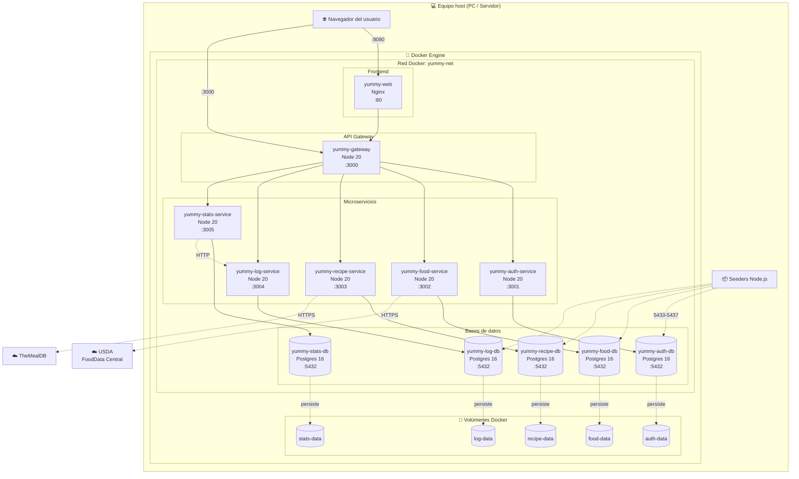
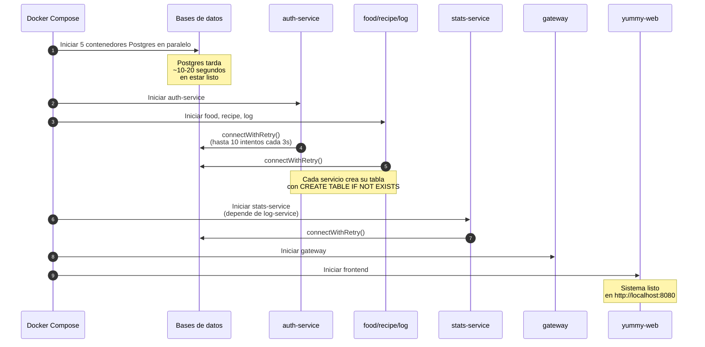

# 🚀 Diagrama de Despliegue

**Proyecto:** YummyNutrition
**Versión del documento:** 1.0
**Fecha:** Abril 2026

---

## 1. Introducción

Este documento describe cómo se despliega físicamente el sistema YummyNutrition. Mientras que los documentos `04-diseno-servicios.md` y `06-diseno-base-datos.md` describen los componentes a nivel lógico, este documento se enfoca en el plano físico: cómo se distribuyen los componentes en contenedores Docker, cómo se conectan entre sí mediante una red interna, qué puertos se exponen al exterior, y cómo se inicia y detiene el sistema completo.

## 2. Estrategia de despliegue

El sistema completo se despliega como un **conjunto de contenedores Docker orquestados con Docker Compose**. Esta estrategia ofrece varias ventajas importantes:

- **Reproducibilidad**: cualquier persona con Docker instalado puede levantar el sistema completo con un único comando.
- **Aislamiento**: cada servicio corre en su propio contenedor, con sus propias dependencias, sin interferir con el sistema host ni con otros contenedores.
- **Portabilidad**: el sistema funciona idéntico en Windows, macOS, Linux y servidores en la nube, siempre que tengan Docker.
- **Coherencia entre desarrollo y producción**: el mismo `docker-compose.yml` se usa para desarrollo local, demos y un eventual despliegue en servidor.

El sistema completo consta de **12 contenedores** corriendo simultáneamente, organizados en cuatro categorías: bases de datos, microservicios, gateway y frontend web.

## 3. Diagrama global de despliegue

El siguiente diagrama representa el sistema desplegado. Se muestran:

- El equipo host (PC del desarrollador o servidor) que ejecuta Docker Engine.
- La red Docker `yummy-net` que aísla la comunicación entre contenedores.
- Los 12 contenedores con sus puertos internos y los puertos expuestos al host.
- Las APIs externas que el sistema consume.
- Los volúmenes Docker que persisten los datos de las bases de datos.



## 4. Componentes del despliegue

### 4.1 Contenedores

| Contenedor | Imagen base | Puerto interno | Puerto host | Categoría |
|------------|-------------|----------------|-------------|-----------|
| `yummy-auth-db` | `postgres:16` | 5432 | 5433 | Base de datos |
| `yummy-food-db` | `postgres:16` | 5432 | 5434 | Base de datos |
| `yummy-recipe-db` | `postgres:16` | 5432 | 5435 | Base de datos |
| `yummy-log-db` | `postgres:16` | 5432 | 5436 | Base de datos |
| `yummy-stats-db` | `postgres:16` | 5432 | 5437 | Base de datos |
| `yummy-auth-service` | `node:20-alpine` | 3001 | — (no expuesto) | Microservicio |
| `yummy-food-service` | `node:20-alpine` | 3002 | — (no expuesto) | Microservicio |
| `yummy-recipe-service` | `node:20-alpine` | 3003 | — (no expuesto) | Microservicio |
| `yummy-log-service` | `node:20-alpine` | 3004 | — (no expuesto) | Microservicio |
| `yummy-stats-service` | `node:20-alpine` | 3005 | — (no expuesto) | Microservicio |
| `yummy-gateway` | `node:20-alpine` | 3000 | 3000 | API Gateway |
| `yummy-web` | `nginx` (multi-stage) | 80 | 8080 | Frontend |

**Total: 12 contenedores.**

### 4.2 Puertos expuestos al host

Solo se exponen al host los puertos estrictamente necesarios para la operación del sistema:

| Puerto host | Componente | Propósito |
|-------------|------------|-----------|
| **3000** | API Gateway | Único punto de entrada para clientes externos a la API |
| **8080** | Frontend web | Acceso al sistema desde el navegador |
| **5433-5437** | 5 bases de datos PostgreSQL | Acceso para seeders y herramientas de administración |

Los **microservicios no exponen sus puertos al host**. Solo son accesibles desde dentro de la red Docker `yummy-net`. Esto refuerza la seguridad: los clientes deben pasar obligatoriamente por el gateway, no pueden saltarse a un microservicio individualmente.

### 4.3 Red Docker

Todos los contenedores comparten la red Docker `yummy-net`, definida en `docker-compose.yml`:

```yaml
networks:
  yummy-net:
    driver: bridge
```

**Características de esta red:**

- Es una red **bridge** privada gestionada por Docker.
- Los contenedores se descubren entre sí por **nombre de contenedor** (DNS interno automático). Por ejemplo, el `stats-service` consulta a `log-service` usando la URL `http://log-service:3004`.
- El tráfico dentro de la red está aislado del host y de otras redes Docker.
- Facilita la portabilidad: si en el futuro se despliega en Kubernetes o Docker Swarm, el modelo de red sigue siendo el mismo conceptualmente.

### 4.4 Volúmenes Docker

Cada base de datos PostgreSQL tiene un volumen Docker dedicado donde persiste sus datos:

```yaml
volumes:
  auth-data:
  food-data:
  recipe-data:
  log-data:
  stats-data:
```

Los volúmenes se montan en `/var/lib/postgresql/data` dentro de cada contenedor de Postgres. Esto garantiza que los datos sobrevivan a:

- Reinicios de los contenedores (`docker compose restart`).
- Recreación de los contenedores (`docker compose up -d --build`).
- Apagado del sistema completo (`docker compose down`).

Solo el comando `docker compose down -v` elimina los volúmenes y borra los datos. Es una operación de reset total que se usa raramente.

## 5. Configuración por variables de entorno

Cada contenedor se configura mediante variables de entorno definidas en `docker-compose.yml`. Esto cumple con el principio Twelve-Factor App de **configuración mediante entorno**.

### 5.1 Variables comunes a todos los servicios Node

| Variable | Valor | Descripción |
|----------|-------|-------------|
| `PORT` | `3000` a `3005` | Puerto interno del servicio |
| `TZ` | `America/Mexico_City` | Zona horaria del contenedor |
| `DB_HOST` | nombre del contenedor de BD | Hostname dentro de la red Docker |
| `DB_PORT` | `5432` | Puerto interno de Postgres |
| `DB_USER` | `postgres` | Usuario de la BD |
| `DB_PASSWORD` | `1234` | Contraseña de la BD |
| `DB_NAME` | nombre de la BD | Base de datos a la que se conecta |

### 5.2 Variables específicas

| Servicio | Variable | Propósito |
|----------|----------|-----------|
| `auth-service` | `JWT_SECRET` | Firma los JWTs emitidos |
| `log-service` | `JWT_SECRET` | Valida los JWTs recibidos |
| `stats-service` | `JWT_SECRET` | Valida los JWTs recibidos |
| `stats-service` | `LOG_SERVICE_URL` | URL del log-service para llamadas internas |
| `food-service` | `USDA_API_KEY` | Llave de API de USDA FoodData Central |

El `JWT_SECRET` es el **mismo valor** para los tres servicios que lo usan, ya que la firma debe ser verificable por todos los servicios que validan tokens.

## 6. Configuración de zona horaria

Un detalle particular del despliegue es la configuración de la **zona horaria**. Por defecto, los contenedores Docker basados en Alpine Linux operan en UTC. Esto causaba un desfase de 6 horas con la zona horaria de México y provocaba que el cálculo de "hoy" en `stats-service` se desincronizara con la percepción del usuario.

La solución consistió en dos pasos coordinados:

**1. Variable de entorno `TZ` en `docker-compose.yml`** para los 12 contenedores:

```yaml
environment:
  TZ: America/Mexico_City
```

**2. Instalación del paquete `tzdata` en los Dockerfiles** de los 6 contenedores Node Alpine:

```dockerfile
FROM node:20-alpine
RUN apk add --no-cache tzdata
ENV TZ=America/Mexico_City
```

Las imágenes de PostgreSQL ya incluyen `tzdata` por defecto, por lo que solo necesitaron la variable de entorno. Las imágenes de Node Alpine no lo incluyen para minimizar el tamaño, por lo que requirieron la línea `RUN apk add` adicional.

## 7. Comandos de operación

El sistema se opera mediante un conjunto reducido de comandos de Docker Compose:

### 7.1 Ciclo de vida básico

```bash
# Levantar todo el sistema (primera vez o tras cambios de configuración)
docker compose up -d --build

# Levantar todo el sistema (sin reconstruir imágenes)
docker compose up -d

# Detener el sistema sin perder datos
docker compose down

# Detener y borrar todos los datos (reset total)
docker compose down -v
```

### 7.2 Inspección y depuración

```bash
# Ver estado de los 12 contenedores
docker ps

# Ver logs en vivo de todos los servicios
docker compose logs -f

# Ver logs de un servicio específico
docker logs yummy-stats-service

# Conectarse a la base de datos de un servicio
docker exec -it yummy-auth-db psql -U postgres -d authdb

# Verificar la zona horaria de un contenedor
docker exec yummy-stats-service date
```

### 7.3 Reconstrucción selectiva

```bash
# Reconstruir solo un servicio específico (sin afectar al resto)
docker compose up -d --build stats-service

# Reconstruir solo el frontend tras cambios en React
docker compose up -d --build web
```

## 8. Flujo de inicio del sistema

Cuando se ejecuta `docker compose up -d`, los contenedores se inician en un orden coordinado mediante la directiva `depends_on`:



### 8.1 Política de reintento de conexión

Cada microservicio implementa una función `connectWithRetry()` definida en `db.js`. Esta función intenta conectarse a la base de datos hasta **10 veces** con un intervalo de **3 segundos** entre intentos. Esto garantiza que el servicio espere a que su base de datos esté lista antes de fallar.

Esta política de reintento es necesaria porque, aunque `depends_on` en Docker Compose garantiza que la BD se inicie antes que el servicio, **no garantiza que la BD esté lista para aceptar conexiones**. Postgres puede tardar varios segundos adicionales en inicializar el motor después de que el contenedor esté en estado "running".

## 9. Recursos del sistema

### 9.1 Requerimientos mínimos del host

El sistema completo consume aproximadamente:

| Recurso | Consumo aproximado | Notas |
|---------|---------------------|-------|
| **RAM** | 1.5 GB - 2 GB | 12 contenedores corriendo simultáneamente |
| **CPU** | 1-2 núcleos en uso ligero | Picos al cachear consultas externas |
| **Disco** | 1-2 GB | Imágenes Docker + volúmenes con datos de prueba |
| **Red** | Mínima | Solo se requiere internet para consultar USDA y TheMealDB |

### 9.2 Recomendación de host

Para un despliegue de demostración o desarrollo, se recomienda un equipo con:

- 8 GB de RAM
- Docker Desktop o Docker Engine instalado
- 5 GB de espacio libre en disco
- Conexión a internet (para descargar las imágenes Docker la primera vez y para consultas a APIs externas durante el uso)

## 10. Estrategias de despliegue alternativas

Aunque el proyecto se despliega actualmente en una única máquina con Docker Compose, la arquitectura está diseñada para soportar otras estrategias de despliegue sin cambios significativos en el código:

| Estrategia | Cambios necesarios | Beneficio |
|------------|-------------------|-----------|
| **Múltiples máquinas en red local** | Ajustar URLs en variables de entorno y usar Docker Swarm | Mayor capacidad y separación física de componentes |
| **Despliegue en Kubernetes** | Crear archivos `Deployment` y `Service` para cada componente | Auto-recuperación, escalado horizontal, blue/green deploy |
| **Cloud (AWS, GCP, Azure)** | Usar servicios gestionados de bases de datos (RDS, Cloud SQL) | Backups automáticos, alta disponibilidad |
| **Serverless híbrido** | Migrar microservicios a funciones lambda y mantener BDs gestionadas | Pago por uso, escalado automático |

Estas alternativas comparten el mismo modelo conceptual (microservicios, BDs aisladas, gateway) y pueden adoptarse de forma incremental conforme el sistema crezca.