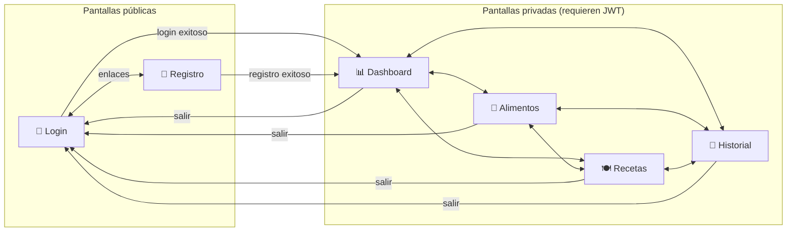
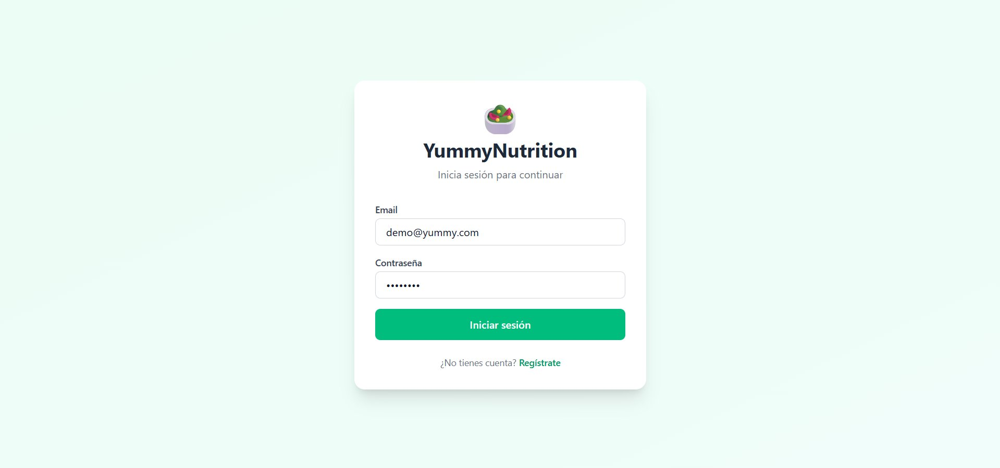
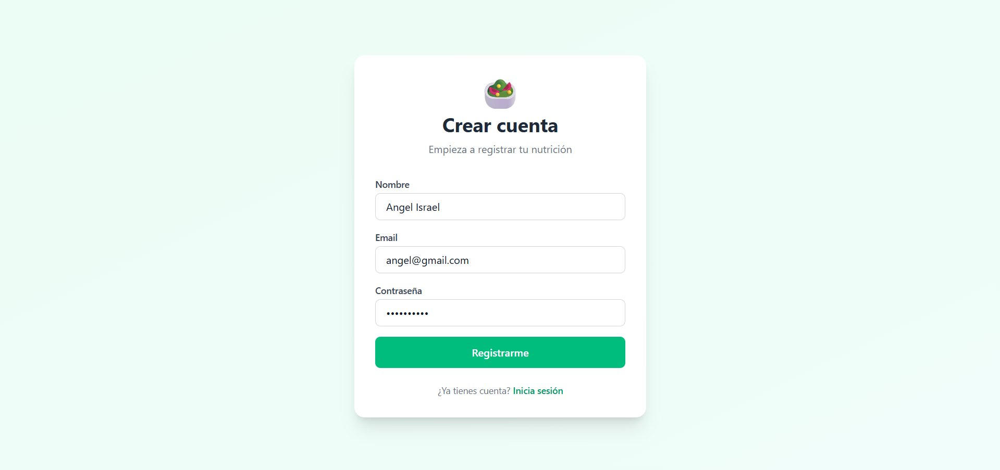
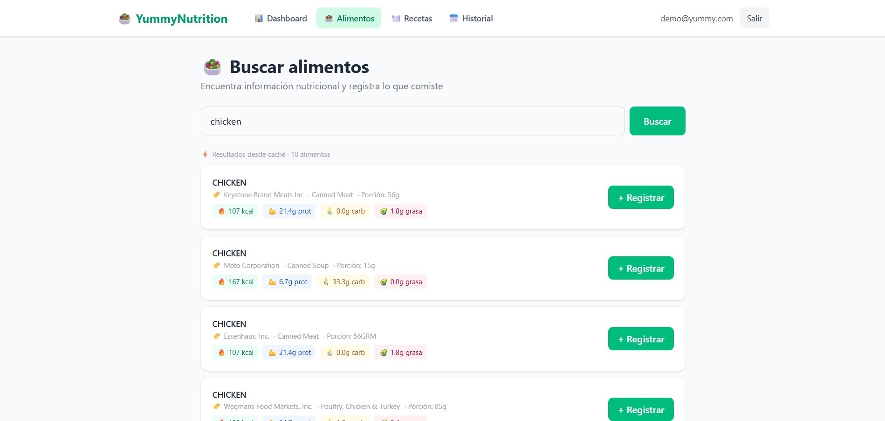
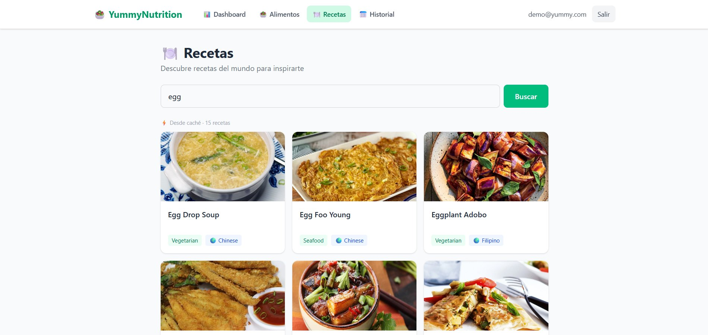
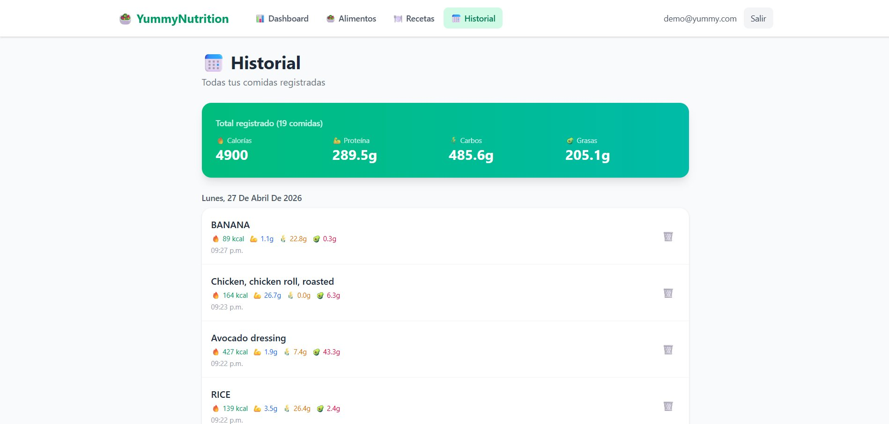

# 🎨 Wireframes

**Proyecto:** YummyNutrition
**Versión del documento:** 1.0
**Fecha:** Abril 2026

---

## 1. Introducción

Este documento presenta los wireframes de las seis pantallas que componen la aplicación web de YummyNutrition. Cada wireframe incluye una captura del estado real de la pantalla en producción, una descripción de su propósito dentro del flujo del usuario, la anatomía detallada de sus componentes visuales, y el comportamiento principal asociado a cada interacción. La intención es que esta documentación sirva como referencia visual del producto terminado y permita validar que la implementación cumple con los casos de uso definidos en `02-casos-de-uso.md`.

Las capturas fueron tomadas con datos reales del usuario demo (`demo@yummy.com`) sobre la web servida por Nginx en `localhost:8080`. La aplicación móvil Android implementa los mismos casos de uso que la web pero con una jerarquía visual adaptada al tamaño de pantalla y a los patrones de Material Design 3, por lo que sus pantallas no se documentan aquí; el flujo de navegación es equivalente.

## 2. Mapa de pantallas y navegación

El sistema cuenta con seis pantallas web, dos públicas (Login y Registro) y cuatro privadas que requieren sesión activa. La navegación entre pantallas privadas se realiza mediante una barra de navegación superior (`Navbar`) presente en todas ellas, mientras que las pantallas públicas son accesibles únicamente sin sesión y se redirigen entre sí.

El componente `ProtectedRoute` envuelve a las pantallas privadas y verifica la presencia de un JWT válido en el contexto de autenticación; en su ausencia, redirige a Login.

## 3. Pantalla: Login

### 3.1 Propósito

Permitir a un usuario existente autenticarse en el sistema. Es la primera pantalla que ve cualquier visitante que llegue a la URL raíz sin sesión activa.

### 3.2 Anatomía

La pantalla está centrada visualmente en el viewport, con un fondo verde claro neutro y una tarjeta blanca con esquinas redondeadas y sombra suave que contiene el formulario. El logo de la aplicación (un emoji de ensalada) y el nombre **YummyNutrition** encabezan la tarjeta, seguidos del subtítulo *"Inicia sesión para continuar"* que orienta al usuario.

El formulario contiene dos campos verticales: **Email** (entrada de texto con validación de formato de correo) y **Contraseña** (entrada de tipo `password` con texto enmascarado). Debajo se encuentra el botón principal **Iniciar sesión** en color verde sólido, que ocupa el ancho completo del formulario y comunica claramente la acción primaria.

Al pie de la tarjeta, un texto secundario *"¿No tienes cuenta?"* acompañado de un enlace verde **Regístrate** ofrece la ruta alternativa para usuarios nuevos.

### 3.3 Comportamiento

Al enviar el formulario con credenciales válidas, el frontend hace `POST /api/auth/login` al gateway. Si la respuesta es exitosa, recibe un token JWT que se almacena en el contexto de autenticación y en `localStorage`, y la aplicación navega a `/dashboard`. Ante credenciales incorrectas se muestra un mensaje de error contextual sin recargar la página. El enlace **Regístrate** navega a `/register` mediante React Router.

## 4. Pantalla: Registro

### 4.1 Propósito

Permitir a un visitante crear una cuenta nueva en el sistema. El registro requiere tres datos mínimos: nombre, email y contraseña.

### 4.2 Anatomía

Mantiene la misma maquetación visual que Login para reforzar la consistencia: tarjeta blanca centrada sobre fondo verde claro, logo y título arriba, subtítulo orientativo (*"Empieza a registrar tu nutrición"*) y formulario debajo.

A diferencia de Login, el formulario incluye tres campos: **Nombre** (texto libre, obligatorio), **Email** (con validación de formato) y **Contraseña** (enmascarada). El botón principal **Registrarme** vuelve a ocupar el ancho completo y mantiene el verde corporativo.

Al pie aparece el enlace inverso *"¿Ya tienes cuenta? Inicia sesión"* que devuelve al usuario a Login.

### 4.3 Comportamiento

Al enviar el formulario, el frontend hace `POST /api/auth/register` con los tres campos. El backend hashea la contraseña con bcrypt antes de persistirla en `authdb`. Si el email ya existe, el servidor responde 400 y el frontend muestra el mensaje *"El email ya está registrado"*. Tras un registro exitoso, el flujo continúa autenticando al usuario automáticamente con las mismas credenciales y redirigiendo a Dashboard, ahorrando un paso al usuario.

## 5. Pantalla: Dashboard

### 5.1 Propósito

Es la pantalla principal del usuario autenticado. Concentra el resumen nutricional del día actual y muestra las comidas más recientes registradas. Cumple el caso de uso *"Consultar resumen nutricional del día"*.

### 5.2 Anatomía

La cabecera horizontal **Navbar** contiene a la izquierda el logo y el nombre **YummyNutrition**, en el centro las cuatro pestañas de navegación (Dashboard, Alimentos, Recetas, Historial) con la pestaña activa destacada en verde, y a la derecha el email del usuario logueado y el botón **Salir** que ejecuta el logout. Esta navbar es idéntica en todas las pantallas privadas.

El cuerpo principal saluda al usuario por su nombre con el formato *"👋 Hola, Demo User"* y un subtítulo descriptivo. A continuación, una sección **📊 Totales de hoy** presenta cuatro tarjetas en grid que muestran los macronutrientes acumulados del día con código de color por categoría: **Calorías** en verde, **Proteína** en azul, **Carbos** en ámbar, **Grasas** en rosa. Cada tarjeta incluye un emoji identificador, el nombre del macro, el valor numérico grande y la unidad. Debajo del grid aparece un contador secundario *"4 comidas registradas hoy"*.

La sección inferior **🕒 Últimas comidas registradas** lista las comidas más recientes en orden cronológico descendente, cada una en una fila con dos columnas: a la izquierda el nombre del alimento y la fecha-hora de registro, a la derecha las calorías totales destacadas en verde y los macros desglosados en formato compacto (`P: 1.1g · C: 22.8g · G: 0.3g`).

### 5.3 Comportamiento

Al cargar la pantalla, el componente ejecuta dos peticiones en paralelo: `GET /api/stats/:userId` para obtener los totales del día y `GET /api/logs` para obtener el historial completo del cual se muestran los cinco más recientes. Las fechas y horas se formatean con el helper `formatDateTimeMx`, que fuerza la zona horaria `America/Mexico_City` independientemente de la zona del navegador, garantizando consistencia con la app Android y con el backend.

## 6. Pantalla: Alimentos

### 6.1 Propósito

Permitir al usuario buscar información nutricional de cualquier alimento y registrar el consumo de una porción. Cumple los casos de uso *"Buscar alimento"* y *"Registrar consumo de comida"*.

### 6.2 Anatomía

Tras la navbar, el encabezado **🥗 Buscar alimentos** introduce la pantalla con el subtítulo *"Encuentra información nutricional y registra lo que comiste"*. Una caja de búsqueda ancha con placeholder y un botón verde **Buscar** a la derecha conforman el área de entrada principal.

Al ejecutar una búsqueda, debajo aparece un indicador de origen de los datos (*"⚡ Resultados desde caché · 10 alimentos"* o *"Resultados desde USDA"* la primera vez), seguido de una lista vertical de tarjetas, una por alimento encontrado. Cada tarjeta contiene en la columna izquierda el **nombre del alimento** en mayúsculas, una línea descriptiva con el fabricante, la categoría y la porción de referencia (*"Keystone Brand Meats Inc · Canned Meat · Porción: 56g"*), y una fila inferior con cuatro chips de macros con sus iconos: kcal en verde, proteína en azul, carbohidratos en ámbar, grasa en rosa. En la columna derecha de cada tarjeta, un botón **+ Registrar** verde permite añadir esa comida a los logs del usuario.

### 6.3 Comportamiento

La búsqueda dispara `GET /api/foods/search?q=<query>`. El food-service primero consulta su caché en `fooddb`; si encuentra resultados los devuelve marcando `source: "cache"`, de lo contrario consulta la API externa de USDA, persiste los resultados en caché y los devuelve marcando `source: "usda"`. Esta estrategia minimiza llamadas externas y mejora la velocidad de respuesta.

El botón **+ Registrar** ejecuta `POST /api/logs` con los nutrientes del alimento. El user_id se extrae del JWT en el backend, no se envía en el body, por seguridad. Tras un registro exitoso, los totales del Dashboard se actualizarán al volver a esa pantalla.

## 7. Pantalla: Recetas

### 7.1 Propósito

Permitir al usuario explorar recetas saludables del mundo como inspiración para sus comidas. Cumple el caso de uso *"Buscar recetas"*.

### 7.2 Anatomía

El encabezado **🍽️ Recetas** y el subtítulo *"Descubre recetas del mundo para inspirarte"* introducen la pantalla. Como en Alimentos, hay una caja de búsqueda con un botón verde **Buscar**.

Los resultados se presentan como un **grid de tarjetas visuales** de tres columnas en pantallas amplias. Cada tarjeta tiene en la parte superior una imagen grande de la receta y en la parte inferior una zona de información con: el nombre de la receta como título, y una fila de etiquetas con la categoría (*"Vegetarian"*, *"Seafood"*) y la región geográfica acompañada de un emoji (*"🌐 Chinese"*, *"🌐 Filipino"*). El indicador *"Desde caché · 15 recetas"* aparece arriba del grid si los datos vienen del caché local.

### 7.3 Comportamiento

La búsqueda dispara `GET /api/recipes/search?q=<query>`. El recipe-service aplica la misma estrategia de caché que food-service pero contra TheMealDB en lugar de USDA. Al hacer click sobre una tarjeta, el flujo navega a un detalle de receta donde se ven los ingredientes, las instrucciones y el video de YouTube si la receta lo incluye. El detalle se carga con `GET /api/recipes/:id`.

## 8. Pantalla: Historial

### 8.1 Propósito

Mostrar el listado completo de las comidas registradas por el usuario, agrupadas por día y con totales acumulados. Permite también eliminar registros individuales. Cumple los casos de uso *"Consultar historial completo"* y *"Eliminar registro de comida"*.

### 8.2 Anatomía

Tras la navbar, el encabezado **📅 Historial** y el subtítulo *"Todas tus comidas registradas"* introducen la pantalla.

La parte superior está ocupada por un **banner verde degradado** que resume la totalidad histórica del usuario: el conteo total de comidas (*"Total registrado (19 comidas)"*) y debajo cuatro métricas en línea con las suma absoluta de calorías, proteína, carbos y grasas, cada una con su emoji y unidad. Es la única pantalla que muestra acumulados históricos en lugar de del día.

Debajo, los registros se agrupan por día con un encabezado de fecha legible en español (*"Lunes, 27 De Abril De 2026"*). Cada registro de comida es una fila con: el nombre del alimento en negritas como título, una segunda línea con los cuatro chips de macros (kcal, prot, carb, grasa con sus iconos y colores), una tercera línea con la hora exacta del registro (*"09:27 p.m."*), y a la derecha un icono de papelera 🗑️ para eliminar.

### 8.3 Comportamiento

La pantalla carga `GET /api/logs` al montarse y agrupa los resultados por día usando el helper `getDayKeyMx`, que calcula la clave de día en zona México (no UTC) para evitar que un registro hecho a las 11pm caiga en el día siguiente UTC. Los totales globales se calculan en el cliente sumando todos los logs.

El icono de papelera ejecuta `DELETE /api/logs/:id` tras pedir confirmación al usuario con un `confirm()` nativo. La eliminación es inmediata en el cliente (optimistic update) y muestra un toast de éxito en la parte inferior de la pantalla. Si el log eliminado pertenece al día actual, los totales del Dashboard reflejarán la baja al volver a esa pantalla.

## 9. Consistencia visual y patrones recurrentes

A lo largo de las seis pantallas se aplican un conjunto de patrones visuales y de interacción que dan unidad al producto:

**Paleta de colores semántica.** El verde corporativo (`emerald-500`) marca todas las acciones primarias y los enlaces. Los macronutrientes mantienen siempre los mismos colores: verde para calorías, azul para proteína, ámbar para carbos, rosa para grasas. Los errores usan rojo claro y los toasts de éxito gris oscuro con texto blanco.

**Tipografía y jerarquía.** Los títulos de pantalla usan tamaño grande con peso bold y un emoji decorativo a la izquierda. Los subtítulos son grises medios y describen brevemente el propósito de la pantalla. Los datos numéricos importantes (calorías, macros) se destacan con tamaño grande y peso bold sobre fondos suaves.

**Tarjetas como contenedor base.** Todas las agrupaciones de información se presentan en tarjetas con esquinas redondeadas (`rounded-2xl`) y sombras suaves, lo que crea una sensación de profundidad consistente. Las tarjetas se alinean en grids responsivos que se reducen a una columna en móvil.

**Feedback inmediato.** Las acciones que escriben en el backend (registrar comida, eliminar log) muestran un toast efímero al pie de la pantalla con un emoji de check y el resultado. Los estados de carga se manejan con texto descriptivo (*"Cargando historial..."*, *"Cargando tus datos..."*) en lugar de spinners genéricos.

**Manejo explícito de la zona horaria.** Toda visualización de fechas pasa por los helpers de `utils/date.js`, que fuerzan `America/Mexico_City` independientemente de la configuración del navegador, garantizando que un usuario en cualquier zona del mundo vea las horas tal como las registró.

Estos patrones, además de mejorar la experiencia, simplifican el mantenimiento: agregar una pantalla nueva consiste en componer estos bloques ya conocidos en lugar de inventar estilos.
