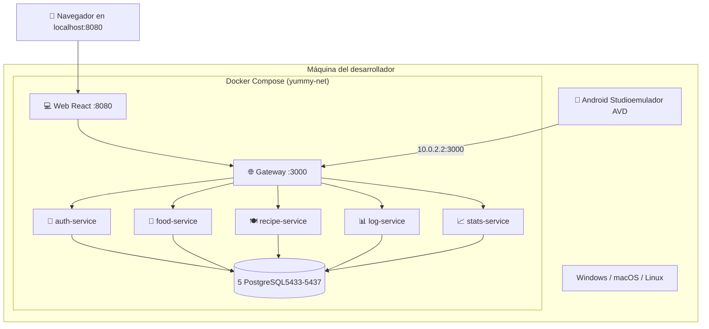

# 🚀 Guía de Despliegue

**Proyecto:** YummyNutrition
**Versión del documento:** 1.0
**Fecha:** Abril 2026

---

## 1. Introducción

Este documento describe el procedimiento completo para desplegar el sistema YummyNutrition desde cero en una máquina de desarrollo. Cubre los requisitos previos, la obtención del código fuente, el levantamiento del backend y la web mediante Docker, la carga de datos de prueba, la verificación del estado de los servicios, la ejecución de la aplicación Android, la suite de pruebas automatizadas y la solución de los problemas más frecuentes que pueden surgir durante el proceso. La guía está pensada para que cualquier persona con conocimientos básicos de línea de comandos pueda dejar el sistema corriendo en menos de quince minutos.

## 2. Arquitectura del despliegue

El despliegue se compone de tres bloques que se levantan de forma independiente: el backend dockerizado (gateway, cinco microservicios, cinco bases de datos PostgreSQL), el frontend web servido por Nginx dentro del mismo `docker-compose`, y la aplicación Android nativa que se compila con Android Studio y se conecta al gateway por la red del emulador.



El emulador Android se comunica con el gateway a través de la dirección especial `10.0.2.2`, que en emuladores AVD apunta al `localhost` del host. Por su parte, el navegador y el frontend web se comunican con el gateway a través de `localhost:3000`. Toda la red interna entre microservicios y bases de datos vive dentro de la red Docker `yummy-net` y no se expone al host salvo los puertos explícitamente publicados.

## 3. Prerrequisitos

Para reproducir el entorno completo se necesitan las siguientes herramientas instaladas en la máquina del desarrollador:

| Herramienta | Versión mínima | Necesaria para |
|-------------|----------------|----------------|
| **Docker Desktop** | 4.30+ con WSL2 (Windows) | Backend completo y frontend web |
| **Git** | 2.40+ | Clonar el repositorio |
| **Node.js** | 20 LTS | Ejecutar seeders y tests Jest/Cypress |
| **Android Studio** | Hedgehog 2023.1.1+ | Compilar y ejecutar la app Android |
| **JDK** | 17 | Compilar el proyecto Android (incluido en Studio) |

En sistemas Windows es indispensable que Docker Desktop esté configurado con el backend de WSL2 y que la virtualización por hardware esté habilitada en BIOS, de lo contrario los contenedores arrancarán muy lentamente o fallarán. Se recomienda asignar al menos 4 GB de RAM y 2 núcleos a Docker desde su panel de configuración.

No es necesario instalar PostgreSQL, Node.js ni librerías del backend en el host: todo eso vive dentro de los contenedores. Node.js solo hace falta para los seeders y los tests, que se ejecutan desde el host por simplicidad.

## 4. Obtención del código

El repositorio es público y se clona con un comando estándar:

```bash
git clone https://github.com/MichCelis/Yummy_Nutrition.git
cd Yummy_Nutrition
```

La estructura general del repositorio es la siguiente:

```
Yummy_Nutrition/
├── backend/                  # Microservicios Node.js
│   ├── auth-service/
│   ├── food-service/
│   ├── recipe-service/
│   ├── log-service/
│   ├── stats-service/
│   └── gateway/
├── web/                      # Frontend React + Vite + Nginx
├── app/                      # App Android Kotlin + Compose
├── seeders/                  # Scripts de carga de datos demo
├── e2e/                      # Pruebas end-to-end con Cypress
├── docs/                     # Documentación del proyecto
├── docker-compose.yml        # Orquestación de los 12 contenedores
├── README.md
├── API_CONTRACT.md           # Contratos REST entre servicios
├── COMANDOS.md               # Comandos útiles del proyecto
└── ESTADO.md                 # Notas internas de avance
```

## 5. Levantamiento del backend y la web

Desde la raíz del repositorio, un único comando levanta los doce contenedores que componen el sistema:

```bash
docker compose up -d
```

La bandera `-d` (detached) hace que los contenedores arranquen en segundo plano y devuelvan el control de la terminal. La primera vez este comando puede tardar entre tres y diez minutos porque Docker debe descargar la imagen de PostgreSQL 16, construir las imágenes de cada microservicio y de la web, instalar dependencias de Node y compilar el bundle de producción del frontend. Las invocaciones posteriores son mucho más rápidas porque todo queda cacheado.

Durante el arranque conviene observar el progreso con el siguiente comando, que muestra los logs de los servicios en tiempo real:

```bash
docker compose logs -f
```

Cuando todos los servicios están listos, en los logs aparecen mensajes como `✅ Conectado a PostgreSQL`, `📊 Log Service corriendo en puerto 3004` y `📈 Stats Service corriendo en puerto 3005`. Para salir del seguimiento de logs basta con presionar `Ctrl+C`; los contenedores siguen corriendo en segundo plano.

### 5.1 Verificación del estado de los contenedores

Para confirmar que los doce contenedores están arriba y sanos:

```bash
docker compose ps
```

La salida debe mostrar todos los servicios con estado `running` o `Up`:

| Contenedor | Puerto host | Descripción |
|------------|-------------|-------------|
| `yummy-gateway` | `3000` | API Gateway, único punto de entrada |
| `yummy-web` | `8080` | Frontend React servido por Nginx |
| `yummy-auth-service` | (interno) | Identidad y JWT |
| `yummy-food-service` | (interno) | Búsqueda de alimentos vía USDA |
| `yummy-recipe-service` | (interno) | Recetas vía TheMealDB |
| `yummy-log-service` | (interno) | Registro de comidas |
| `yummy-stats-service` | (interno) | Cálculo de estadísticas diarias |
| `yummy-auth-db` | `5433` | PostgreSQL para auth |
| `yummy-food-db` | `5434` | PostgreSQL para food |
| `yummy-recipe-db` | `5435` | PostgreSQL para recipes |
| `yummy-log-db` | `5436` | PostgreSQL para logs |
| `yummy-stats-db` | `5437` | PostgreSQL para stats |

Solo los puertos del gateway, la web y las cinco bases de datos están expuestos al host. Los microservicios de aplicación viven exclusivamente dentro de la red Docker y son accesibles únicamente a través del gateway, lo que es coherente con el patrón API Gateway descrito en `04-diseno-servicios.md`.

### 5.2 Pruebas de salud rápidas

Una vez que `docker compose ps` muestra todo arriba, se pueden hacer dos comprobaciones rápidas desde el navegador o con `curl`:

```bash
curl http://localhost:3000/
curl http://localhost:3000/health
```

La primera devuelve un JSON con metadatos del gateway y el listado de rutas. La segunda devuelve un `200 OK` simple. Si ambas responden, el backend está sano.

Para confirmar que la web también responde, basta con abrir en el navegador:

```
http://localhost:8080
```

Se debe ver la pantalla de login de YummyNutrition. Aún no es posible iniciar sesión porque las bases de datos están vacías; eso se resuelve en el siguiente paso.

## 6. Carga de datos de prueba (seeders)

El proyecto incluye un conjunto de seeders deterministas que pueblan las bases de datos con un usuario demo, un usuario secundario, alimentos cacheados de USDA, recetas de TheMealDB y quince registros de comidas distribuidos en los últimos siete días para que el dashboard tenga datos visibles desde el primer arranque.

Los seeders se ejecutan desde el host y se conectan a las bases de datos a través de los puertos publicados en `5433-5437`. Por eso se necesita Node.js instalado y las bases de datos arriba.

```bash
cd seeders
npm install      # solo la primera vez
npm run seed
```

El script `npm run seed` ejecuta secuencialmente los cuatro seeders en el orden correcto: primero el de auth (porque otros dependen de los IDs de usuario), luego food, luego recipe y finalmente log. Cada uno imprime en consola cuántos registros insertó. Los seeders son idempotentes: si se vuelven a ejecutar no duplican datos, sino que detectan los registros existentes y solo añaden lo faltante.

Si se desea ejecutar un seeder por separado, los scripts disponibles son:

```bash
npm run seed:auth
npm run seed:food
npm run seed:recipe
npm run seed:log
```

### 6.1 Credenciales de los usuarios sembrados

| Email | Contraseña | Descripción |
|-------|------------|-------------|
| `demo@yummy.com` | `demo1234` | Usuario principal con 15 logs distribuidos en los últimos 7 días |
| `angel@itl.edu.mx` | `angel1234` | Usuario secundario sin logs, útil para probar el estado vacío |

Con el usuario `demo@yummy.com` se puede iniciar sesión inmediatamente en `http://localhost:8080` y ver el dashboard poblado con calorías, macros y comidas recientes.

## 7. Aplicación Android

La app Android es nativa Kotlin con Jetpack Compose y se compila desde Android Studio. Vive en la carpeta `app/` del repositorio y comparte el `build.gradle.kts` y `settings.gradle.kts` raíz con el resto del proyecto.

### 7.1 Apertura del proyecto

1. Abrir Android Studio.
2. **File → Open** y seleccionar la carpeta raíz del repositorio (`Yummy_Nutrition/`).
3. Esperar a que Studio sincronice el proyecto Gradle. La primera vez puede tardar varios minutos porque descarga el SDK de Android, los plugins de Compose y todas las dependencias declaradas. La barra inferior mostrará "Gradle sync in progress" y al terminar dirá "Gradle sync finished".

### 7.2 Configuración del emulador

Si no se tiene un emulador creado, se crea uno con **Tools → Device Manager → Create Device**:

- **Phone:** Medium Phone o Pixel 6
- **System image:** Android 14 (API 34) o Android 16 (API 36)
- **AVD Name:** el que sea, por ejemplo `Medium Phone API 34`

El primer arranque del emulador es lento (uno a dos minutos). Una vez booteado conviene dejarlo abierto durante toda la sesión de desarrollo, porque relanzar la app sobre un emulador caliente toma diez segundos contra noventa segundos en frío.

### 7.3 Conexión al backend

La app está configurada en `RetrofitClient.kt` para apuntar a `http://10.0.2.2:3000/api/`. La dirección `10.0.2.2` es una IP especial de los emuladores AVD que se mapea automáticamente al `localhost` del host, lo que permite a la app acceder al gateway que corre en Docker. **No se debe cambiar esta URL por `localhost` ni por `127.0.0.1`**, porque dentro del emulador esas direcciones apuntan al propio emulador, no al host.

Para que la app funcione, el backend debe estar levantado con `docker compose up -d` antes de lanzar la app desde Studio.

### 7.4 Compilación y ejecución

Con el emulador abierto y el backend corriendo, se compila y lanza la app con el botón de Run (▶️ verde) de la barra superior, o con el atajo **Shift+F10**. La primera compilación tarda dos a cuatro minutos; las siguientes son cuestión de segundos gracias al cacheo incremental de Gradle.

Una vez instalada, la app inicia con la pantalla Splash, lleva a Login y permite autenticarse con las mismas credenciales del usuario demo (`demo@yummy.com / demo1234`). El dashboard mostrará las calorías y macros del día actual obtenidas del stats-service.

## 8. Pruebas automatizadas

El proyecto cuenta con dos suites de pruebas automatizadas: tests unitarios con Jest sobre cada microservicio y tests end-to-end con Cypress sobre la web.

### 8.1 Tests unitarios (Jest)

Cada microservicio tiene su propio `package.json` y su propia carpeta `__tests__/`. Los tests inyectan un mock de la base de datos y usan Supertest para hacer peticiones HTTP simuladas a la app Express, validando responses y comportamiento sin necesidad de PostgreSQL real.

Para ejecutar los tests de un servicio individual:

```bash
cd backend/auth-service
npm install      # solo la primera vez
npm test
```

Y para los demás servicios el procedimiento es idéntico (`backend/food-service`, `backend/recipe-service`, `backend/log-service`, `backend/stats-service`, `backend/gateway`). Cada servicio reporta el número de tests pasados, fallados y la cobertura.

En total el proyecto cuenta con 39 tests unitarios distribuidos entre los seis servicios.

### 8.2 Tests end-to-end (Cypress)

Los tests E2E validan flujos completos sobre la web real corriendo en `localhost:8080`, lo que requiere que `docker compose up -d` esté activo y los seeders cargados. Cypress simula un usuario real que abre el navegador, hace login, registra una comida, navega al historial, etc.

```bash
cd e2e
npm install      # solo la primera vez
npx cypress open      # modo interactivo, abre el navegador de pruebas
npx cypress run       # modo headless, útil para CI
```

El modo interactivo es preferible durante el desarrollo porque permite ver los tests ejecutándose visualmente y depurar paso a paso. El modo headless es ideal para integración continua.

El proyecto incluye 6 tests E2E que cubren los flujos críticos: registro, login, búsqueda de alimentos, registro de comidas, visualización del historial y eliminación de logs.

## 9. Detención y limpieza del entorno

Para detener todos los contenedores manteniendo los datos de las bases:

```bash
docker compose stop
```

Los datos persisten en volúmenes Docker (`auth-data`, `food-data`, etc.) y siguen disponibles la próxima vez que se haga `docker compose up`.

Para detener y eliminar los contenedores conservando los volúmenes:

```bash
docker compose down
```

Para una limpieza completa, eliminando también los volúmenes y por tanto todos los datos sembrados:

```bash
docker compose down -v
```

Esta última opción es útil cuando se quiere empezar desde cero, por ejemplo para validar que los seeders funcionan en una BD vacía, o para probar el flujo de un usuario nuevo que se registra desde la web.

## 10. Solución de problemas frecuentes

A continuación se listan los problemas que se han encontrado durante el desarrollo del proyecto y cómo resolverlos. Esta sección crece con el tiempo y refleja la experiencia real de operar el sistema.

### 10.1 `docker ps` no muestra nada después de un `docker compose up -d`

Si los contenedores aparecen como "Started" en la salida del compose pero `docker ps` devuelve vacío, lo más probable es que se hayan caído inmediatamente al arrancar. Para diagnosticar:

```bash
docker compose ps -a
docker compose logs --tail 50
```

`docker compose ps -a` muestra todos los contenedores incluyendo los que terminaron, mientras que `docker compose logs` revela el error específico. Las causas más comunes son: PostgreSQL aún no está listo y el servicio falla por timeout (raro porque hay reintentos), un puerto del host está ocupado por otro proceso, o falta una variable de entorno.

Si Docker Desktop entra en estado inconsistente y `docker ps` se cuelga, la solución es reiniciar Docker Desktop desde el ícono de la bandeja del sistema, o si eso no funciona, ejecutar `wsl --shutdown` en PowerShell y volver a abrir Docker.

### 10.2 La app Android no puede conectarse al backend

Síntomas en Logcat: errores `ECONNABORTED`, `ECONNREFUSED` o `Connection timed out` durante las peticiones HTTP. Causas posibles, en orden de frecuencia:

**El backend no está arriba.** Verificar con `docker compose ps` que el gateway esté `running`. Probar `curl http://localhost:3000/` desde la terminal del host: si responde, el problema está del lado del emulador.

**El emulador está congelado.** Pasa cuando lleva mucho tiempo encendido. Solución: en Android Studio abrir **Tools → Device Manager**, detener el emulador con el botón de stop, y luego desde los tres puntos elegir **Cold Boot Now**. El cold boot arranca el emulador desde cero sin restaurar el snapshot, lo que limpia procesos zombi.

**Probar la conexión desde el navegador del emulador.** Abrir Chrome dentro del emulador y navegar a `http://10.0.2.2:3000/`. Si responde el JSON del gateway, la red emulador-host funciona y el problema está en la app. Si no responde, el emulador no tiene red al host y se debe reiniciar.

### 10.3 El emulador Android se queda en "Terminating the app"

Síntoma: tras hacer Run en Studio, el deploy se queda atorado en "Terminating the app" durante varios minutos. Significa que ADB perdió comunicación con el emulador.

Solución desde la Terminal de Studio (que sí tiene `adb` en el PATH):

```bash
adb -s emulator-5554 emu kill
```

Eso mata el emulador. Luego desde Device Manager se hace **Cold Boot Now** y se vuelve a dar Run. Como variante más rápida, basta con detener el emulador desde Device Manager y darle Power on de nuevo.

### 10.4 Las horas mostradas no coinciden con la hora local

Si las comidas registradas aparecen seis horas adelantadas o atrasadas, es un problema de zona horaria. El sistema está configurado para devolver siempre UTC desde el backend (columnas `TIMESTAMPTZ`) y convertir a `America/Mexico_City` en los clientes. La zona del backend está fijada en `docker-compose.yml` mediante la variable `TZ=America/Mexico_City` en cada servicio, y los frontends fuerzan la zona México mediante `Intl.DateTimeFormat` (web) y `ZoneId.of("America/Mexico_City")` (Android), independientemente de la zona del navegador o del emulador.

Si el problema persiste, verificar que las migraciones de `TIMESTAMPTZ` se aplicaron correctamente:

```bash
docker exec -it yummy-log-db psql -U postgres -d logdb -c "\d logs"
```

La columna `created_at` debe aparecer como `timestamp with time zone`. Si dice `timestamp without time zone`, el contenedor está usando una imagen vieja y se debe reconstruir:

```bash
docker compose up -d --build log-service stats-service
```

### 10.5 Los seeders fallan con error de conexión

Si `npm run seed` da error tipo `ECONNREFUSED 127.0.0.1:5433`, significa que las bases de datos no están escuchando en los puertos esperados. Verificar con `docker compose ps` que los contenedores `yummy-auth-db`, `yummy-food-db`, etc. estén `running` y que los puertos `5433-5437` estén publicados.

Si los contenedores acaban de arrancar, es posible que PostgreSQL aún esté inicializando. Esperar treinta segundos y reintentar `npm run seed`.

### 10.6 Android Studio compila lento o el daemon de Kotlin muere

Síntoma: builds de cinco minutos o más, error `The daemon has terminated unexpectedly on startup attempt #1 with error code: 0`. Esto pasa cuando el sistema se queda sin memoria, típicamente por correr Docker, Android Studio, el emulador y Chrome al mismo tiempo en una máquina con 16 GB de RAM.

Soluciones acumulativas:

- **Excluir la carpeta del proyecto de Windows Defender:** *Seguridad de Windows → Protección contra virus y amenazas → Exclusiones → Agregar carpeta*. Excluir la carpeta del repo y `~/.gradle`. Reduce los builds en 30-60 segundos cada uno.
- **Ampliar memoria al daemon de Gradle.** En `gradle.properties` raíz, añadir o ajustar: `org.gradle.jvmargs=-Xmx2048m -XX:MaxMetaspaceSize=512m -Dfile.encoding=UTF-8`.
- **Desarrollar sin Docker corriendo.** Mientras se itera código Android, mantener Docker Desktop cerrado. Al momento de probar contra el backend, abrir Docker, esperar a que esté estable y luego dar Run en Studio.

## 11. Resumen de comandos clave

A modo de tarjeta de referencia rápida, estos son los comandos más usados durante la operación del sistema:

| Acción | Comando |
|--------|---------|
| Levantar todo | `docker compose up -d` |
| Reconstruir un servicio | `docker compose up -d --build <servicio>` |
| Ver estado de contenedores | `docker compose ps` |
| Ver logs en vivo | `docker compose logs -f` |
| Ver logs de un servicio | `docker compose logs <servicio> --tail 50` |
| Detener todo | `docker compose stop` |
| Detener y limpiar | `docker compose down` |
| Reset completo (borra datos) | `docker compose down -v` |
| Cargar datos demo | `cd seeders && npm run seed` |
| Tests unitarios de un servicio | `cd backend/<servicio> && npm test` |
| Tests E2E interactivos | `cd e2e && npx cypress open` |
| Conectar a una BD | `docker exec -it yummy-<servicio>-db psql -U postgres -d <db>` |

Con estos comandos cualquier persona puede operar el sistema completo, diagnosticar problemas y avanzar el desarrollo sin necesidad de conocer detalles internos de cada microservicio.
